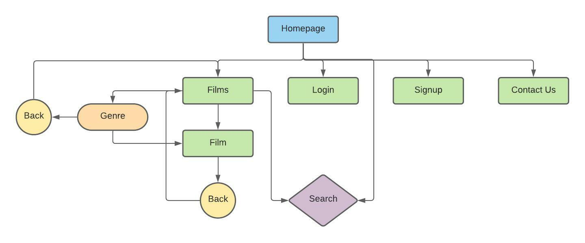

# FilmZone

## Code Institute - Milestone Project 3


<a href="https://filmzone-project.herokuapp.com/" target="_blank">Click here to view FilmZone live</a>

## Table of contents
1. [Introduction](#introduction)
1. [UX](#ux)
    * [User demographic](#user-demographic) 
    * [Main aims](#main-aims)
    * [User Stories](#user-stories)
1. [Development Process](#development-process)
    * [Strategy](#strategy)
    * [Scope](#scope)
    * [Structure](#structure)
    * [Skeleton](#skeleton)
        * [Balsamiq Wireframes](#balsamiq-wireframes)
    * [Surface](#surface)
1. [Development Environment](#development-environment )
1. [Deployment](#deployment)

___

## Introduction
This Milestone project (Python and Data Centric Development) is the third of four that continues to contribute towards my Full Stack Web Developer Diploma with Code Institute. The main requirements in this project are to design a Full-Stack website that allows users to manage a common dataset about a particular domain. Users make use of the site to share their own data with the community, and benefit from having convenient access to the data provided by all other members. The site Administrator/owner will also be a regular visitor to the website and therefore has additional functionalities to the frontend and backend of the site. The site will of authentication in place for any user to sign up to their own account/profile and in turn contribute to the website by adding and editing whilst logged in. The main technologies that need to be used to achieve this is HTML, CSS, JavaScript with the option of using jQuery, Python + Flask, MongoDB and any other suitable libraries, external APIs and tools that will assist in building this Full-Stack website. One of the key aims is to make sure that users can Create, Read, Update and Delete (CRUD conventions) where needed to offer excellent interactive user experience.  

FilmZone is a friendly, easy to use Website for all film lovers to visit. Users can view another users' favourite films and add their own films by signing up to a user account with a username and password of their choosing. With a search facility available, users can quickly find a particular film based on Genre, Actor or Film name keyword. As a keen film lover, I thought of this idea based on my own experiences and thinking that it would be good to have a platform on the internet to tell others what my favourites films are and why. As users aren’t restricted to how many films they can add, I believe that with just a few registered users the library of films within Filmzone could quickly grow and therefore offers new users a broad range of Films to consider watching next.  

I used a core base template during development to keep the Header and Footer the same throughout the whole site for all users to see. The site will have three different types of users: - 

### User One: The logged out/unregistered user 
This user will be able to access the Homepage, Films page where all films added will be available to read. This page shows the Film name, Actors' names, Genre the film falls into, an Image of the film and the name of who added the film. There will also be a search facility Login page, Signup page and a Contact Us page available for users to make contact and comment. 

### User Two: The logged in user 
This user will be able to visit all pages User One has access to. Additionally, this user will have access to their own profile page where they can see all films added giving them the option to edit, delete and view each film. This user can at any point logout. A Contact Us page will be available for users to make contact and comment. 

### User Three: The Admin user 
This user will be able to visit all pages that User One and User Two has access to. Additionally, this user will have access to the Manage Genres page which gives them the option to Edit, Delete and Add a new Genre. NOTE: If a Genre is deleted, any films sitting in that Genre will be automatically allocated to the Genre called ‘Other’. This user can at any point logout. A Contact Us page will be available for users to make contact and comment. 

Date this project started: 23rd August 2021

___

## UX 
User Demographic 

- For film lovers who enjoy watching films on a regular basis  
- For anybody that is looking for a particular firm based on a genre type or actor name
- For film lovers that are interested in sharing their best films with others 
- For film lovers who prefer to watch films at home on their TV or device 
- For film lovers who have access to the internet via computer, tablet or mobile device. 

[Back to top ⇧](#filmzone)

### Main Aims 

#### User Goals 

- Search for a Film based on Genre, Actor name or Film name keyword(s). 
- View all Films added by all users 
- View individual films added by all users 
- View the Homepage ‘Flicks of the week’ 
- User ‘sign-up’ option to login to own profile 
- Logged in users - Add a Film 
- Logged in users - Edit a Film 
- Logged in users - Delete a Film 
- **CRUD** conventions realised and achieved 
- Make contact with the site owner to comment, if required 

#### Developer/Site owner Website Goals 
- ‘Admin’ username and password login 
- Access to ‘Manage Genres’ 
- Add Genre 
- Edit Genre 
- Delete Genre 
- **CRUD** conventions realised and achieved 

#### Developer Aims 
- Create an interesting and easy to use website 
- A platform for Film lovers to use to Create, Read, Update and Delete Film Records 
- Demonstrate the use of front-end and back-end Web development languages recently learnt with CI.  
- Making sure that a non-relational database is used as part of the development for success in storing Users, Film Genres and Film records.  
- Successful deployment adding to the developer portfolio. 

### User Stories 
- A user that doesn’t have an account visits FilmZone and wants ideas on what film to watch for the evening. This user enjoys all types of Films and likes the Actor Al Pacino. 
- A registered user to FilmZone that has just watched a new Film and wants to offer a review for others to consider watching it.  
- A registered user that just finished watching their favourite Film. After which they want to update the Film record on FilmZone to show all site visitors more information i.e. More actors, a different image, a favourite scene change. 
- I’m a regular visitor to FilmZone and would be keen to gain access to my own profile to add my own favourite Films.  
- I have noticed that one of my Films I added last week is now in the ‘Other’ Genre when I originally allocated it to relevant Genre. How can I get feedback on this?
- The Developer/Site Owner sees that there is a quite a few Films being added by registered users into the ‘Other’ Genre category. Quick research shows that a new Genre(s) Category needs to be added to accommodate these Films.  
- Due to a News Report a Film Actor has been discredited and therefore all Films associated to this Actor needs to be removed from the Internet. 

___

### Development Process 
As this project is focused on full stack development and using a non-relational database more time was given to the preparation of the site based on UX Design, the five development planes, the document-oriented database and keeping a full focus on the user goals, developer goals and user stories found above.  

### Strategy 
I started with one overall Strategy where I focused on all users and the developer/site owner goals. 


This was to cluttered and didn’t fully show all goals in a structured way. I therefore broke down the Strategy part of the development into several categories (Unregistered Users, Registered Users, Admin User, General and Developer/Site Owner) 

Unregistered users need to be able to:-
- View Films 
- View ‘Flicks of the Week’ 
- Search for Films 
- Register an Account 
- Contact Us 

Registered users need to be able to:-
- Login with username and password 
- View Films 
- Add Films 
- Edit own Films 
- Delete own Films 
- Search for Films 
- Logout 
- Contact Us 

Admin user needs to be able to:-
- Login with username and password 
- View Films  
- Add Films 
- Edit own Films 
- Delete own Films 
- Search for Films 
- Access ‘Manage Genres’  
- Add a new Genre 
- Edit a Genre  
- Delete a Genre  
- Logout 

General 
- Logo 
- Navbar/Mobile Nav for smaller devices 
- Wide range of Genres 
- Strong Hero Image on the Homepage 
- Document Based Database (see below for details) 

Developer/Site Owner needs to be able to: 
- Access the Non-Relational Database connected to the site 
- View Genres 
- Add a new Genre 
- Edit a Genre 
- Delete a Genre 
- View Films 
- Add a new Film 
- Edit a Film 
- Delete a Film 
- View Users 
- Add a new User 
- Edit a User 
- Delete a User	 

With these goals in mind, I put together diagrams that shows the importance and Viability relevant to each type of user. 


### Scope 
After looking at all possible users, features and user stories from my Strategy I made a list of what I wanted to include in the build of the site based on what features all users would want and how it would be possible to offer these features. I created two releases of the site with release one being the challenge for this project. Any features from release two would be considered for the next phase of this web application but unlikely to be included this time around.  

**Logged out or unregistered users**



**Logged in users**


**Logged in admin user**


**Scope overview**


### Structure 

This website will hold at least **??10??** HTML web pages and therefore I wanted to make sure that all pages followed the same theme using CSS styling and Materialize (Responsive CSS Framework). What I focused on: -  

Navbar made specific to logged out, logged in and Admin users 

- Font size 
- Font styling 
- Colour themes  
- Row and Column Formatting 
- Card Panels 
- Consistency of links 
- Buttons 
- Accordion  
- Hero Image 
- Relevant icons 
- Internal links 
- Logo 
- Copyright 
- Instructions 
- Line breaks 

By maintaining a consistent theme throughout the website, I believe this would offer better overall UX for all visitors to the site. At this stage of the design process, I had a clear idea of what each page would have: - 

The Homepage will offer all users an immediate understanding about FilmZone with the Hero Image and content explanation. The search facility and Films below the Hero Image gives all users access to film recommendations which is the main focus of the site before users either login or signup. One other feature on this page is the ‘Flicks of the week’ which shows 2 or 3 popular films that were added that week. Once logged in, the Homepage Navbar will change slightly with the option to access a ‘Profile’ page and logout when required. 

The Films page will offer users the option to view all films. There is a search facility on this page as well giving users the option to narrow their search by Genre, Actor name and/or Film title. Again, the Homepage Navbar will change slightly with the option to access a ‘Profile’ page and logout when required. 

The Login page is designed for users to login to their account with a username and password which has already been setup. Once logged in users can navigate to the Homepage, Films page, profile page and when ready logout.  

The Sign-up page looks very similar to the Login page. It's designed for new users to sign-up by adding a username and password. Again, once logged in users can navigate to the Homepage, Films page, profile page and when ready logout. 

The Profile page is only available to registered logged in users. This page will only become relevant when a user adds Films to the site. The user can then View, Edit and Delete Films they have added. There is also a link to add new films on this page as well as in the Navbar at the top.  

The Add Film page is designed for users logged in who wish to add a new Film to the website and in turn to their account profile to edit or delete if and when required. There will be a cancel button in place in case the user decides not to add a new film and wants to return to their profile account. 

The Edit Film page looks very similar to the Add Film page. It’s designed for used logged in who wish to Edit a Film they have already added. There will be a cancel button in place in case the user decides not to edit the film and wants to return to their profile account. 

The Manage Genre page is only available to access for logged in Admin accounts. This section of the site is designed to ‘Manage Genres’. This page will hold all added Genres with the option to edit, delete and add new Genre categories. Deleting Genres can cause disruption to the films added to a Genre that’s been deleted. Therefore, I am looking to utilise the ‘Other’ Genre category to push any unallocated Films into ‘Other’. 

Add Genre page gives the admin user the option to add a new Genre to the database and website. There will be a ‘Cancel’ button available in case the admin user decides not to add. 

Edit Genre page will be very similar to the Add Genre page. The only difference is the admin user will need to override the current genre name and click ‘Edit Genre’ to make the change. Again, there will be a ‘Cancel’ button available in case the admin user decides not to edit. 

Contact Us page - TBC 

Structure screenshot 
{png here} 

### Skeleton 

For this part of the design process, I used Balsamiq to sketch out all web pages based on what I want to achieve. 

#### Balsamiq Wireframes

#### Please click <a href="https://github.com/liamwalsh1980/Milestone-Project-3/blob/master/static/images/ux/skeleton/wireframes/filmzone.pdf" target="_blank">PDF Wireframes </a> to see all versions 

As the developer of FilmZone I put a lot of work into making sure that the Wireframes were as close as possible to the finished site. There were a few differences which are highlighted below: -  

TBC 

___

### Surface 

#### Colour Scheme 

I took inspiration from the hero image and using Chrome Dev Tools I was able to put together a colour pallet using cooler.co showing that the colours worked together.  

With the Hero Image photo taken at night time I thought it best to use a black shade background for the header and footer with a white background for the sections in between. Content would be written in a contrasting colour based on the background chosen throughout the website. For example, with a Dark background a white font colour will be used for good overall UX.   

Having particular shades of purple, orange, yellow and green colours available would help with making sure that the website had some character. A lot of the website is taken up using Card panels and images, therefore having other colours available is a must to make sure that card panels, images, forms and content would be visible and easy on the eye.  

FilmZone – Color Pallet


Please click <a href="https://coolors.co/030001-eae3ef-7c526d-d76848-e89549-f8c149-647737" target="_blank">here</a> to see selected colors from coolors.co

#### Typography 

After a little research into what fonts would work best for a website based on Films, I thought it best to have a unique, stand-out font for the title/logo of the site.  

The Logo – FilmZone is designed using the **Holtwood One SC** font sourced from Google Fonts.  

Holtwood is a bold display font developed for use with modern web browsers. It has a lot of the look of some traditional woodblock poster typefaces of the Nineteenth Century but updated for the Twenty First. Holtwood was envisioned to be used in big and bold text sizes, but it still works well when running as smaller headlines too. 

Example: -


The Font chosen for the main content is **Montserrat** again, sourced using Google Fonts and the ‘Pairings’ option to make sure that the **Holtwood One SC** font for the logo would work well with the **Montserra** font.

The Montserrat project is led by Julieta Ulanovsky, a type designer based in Buenos Aires, Argentina. The old posters and signs in the traditional Montserrat neighbourhood of Buenos Aires inspired Julieta Ulanovsky to design this typeface and rescue the beauty of urban typography that emerged in the first half of the twentieth century. As urban development changes that place, it will never return to its original form and loses forever the designs that are so special and unique. The letters that inspired this project have work, dedication, care, colour, contrast, light and life, day and night! These are the types that make the city look so beautiful. The Montserrat Project began with the idea to rescue what is in Montserrat and set it free under a libre license, the SIL Open Font License. 

Example:-


I believe that both fonts complement each other well and with the assurance of Google Fonts pairing both fonts together I know that the website will look attractive, eye catching and easy to read with the combination of good font choices and a strong colour pallet. 

#### Data Schema 

For Filmzone to work this project is based on backend development as well as frontend. With this in mind a Document-Oriented Database / NoSQL Database called MongoDB was created to store all data in three collections called users, films and genres. 


#### Users Collection 

When a user creates an account, all information will be stored in the ‘users’ collection. 

- Username (Unique to the user and connected to ‘Created by’ field from the ‘users’ collection) 
- Password (Unique and secure for the user only) 
- _id (Auto-generated by MongoDB and connected to the ‘films’ and ‘genres’ collections) 

#### Films Collection 

Once signed in, a user can add a new Film. This is stored in the ‘films’ collection. 

- Film name (required) 
- Genre name (required) 
- Actors (required) 
- Favourite scene/Best Bit (required) 
- Image URL
- Media URL (no longer being used)
- Created by (Connected to the ‘username’ field - from the ‘users’ collection) 
- _id (Auto-generated by MongoDB and connected to the ‘users’ and ‘genres’ collections) 

#### Genres Collection 

The Database Genres collection will initially store 20 different film Genres.  


When the Admin user is signed in the Genres section can be amended with the options to add, edit and delete Genres. This is stored in the ‘genres’ collection.  

- Genre name (Connected to the ‘Genre name’ field from the ‘films’ collection) 
- _id (Auto-generated by MongoDB and connected to the ‘users’ and ‘films’ collections) 

## Development Environment 

Within Github I opened a ‘new’ repository and included the Code Institute full template. The New repository will be called liamwalsh1980/Milestone-Project-3 with a brief description of the new application which can be seen below: - 

> A fun and interactive website for Film lovers to sign in and add film reviews and read about other members film recommendations. 

- I then clicked ‘Gitpod’ to open the workspace up.

- I started by installing Flask in the command line using the command $ pip3 install Flask 

Then I added the following new files: - 

- app.py using the command touch app.py (this will be for writing Python code
- env.py using the command touch env.py (this will be for hiding sensitive data) 
- .gitignore should already be created based on the CI template installed when creating the repository. Within the file the env.py file should be added along with the __ pycache __ directory that will be auto-generated shortly.  

Inside the env.py file I added the following: -

- Import os (set our default environment) 

## Deployment 

To deploy this application there were tasks to complete in both the Git command line and Heroku.  

Heroku is a platform as a service (PaaS) that enables developers to build, run, and operate applications entirely in the cloud. 

Before deployment can be completed on Heroku I completed the following steps in the Git terminal.  

A requirments.txt file and Procfile file was created using the command-line.  
- $ pip3 freeze –local > requirements.txt 
- $ echo web: python app.py > Procfile
(I removed the blank line below the Procfile as this could cause issues later on in the project)

Within the command-line, Commit and Push both files to the repository 

- $ git add requirements.txt 
- $ git commit –m “requirement.txt file added” 
- $ git add Procfile 
- $ git commit –m “Procfile added” 
- $ git push 

In Heroku create a new App called ‘filmzone-project’ 

To connect the App, I used the ‘GitHub’ ‘Connect to GitHub’ option. This is the process done by Automatic Deployment from the GitHub repository – ‘Milestone-Project-3'. Once found click ‘connect’ to this App. 

Before clicking ‘Enable Automatic Deploy’ I made sure that the hidden environment variables within env.py file is added within Heroku. Go to ‘Settings’ and then click ‘Reveal Config Vars’ to add the following: -  


# END OF README


Welcome Liam Walsh,

This is the Code Institute student template for Gitpod. We have preinstalled all of the tools you need to get started. You can safely delete this README.md file, or change it for your own project. Please do read it at least once, though! It contains some important information about Gitpod and the extensions we use. The last update to this file was: **July 2, 2021**

## Gitpod Reminders

To run a frontend (HTML, CSS, Javascript only) application in Gitpod, in the terminal, type:

`python3 -m http.server`

A blue button should appear to click: _Make Public_,

Another blue button should appear to click: _Open Browser_.

To run a backend Python file, type `python3 app.py`, if your Python file is named `app.py` of course.

A blue button should appear to click: _Make Public_,

Another blue button should appear to click: _Open Browser_.

In Gitpod you have superuser security privileges by default. Therefore you do not need to use the `sudo` (superuser do) command in the bash terminal in any of the lessons.

To log into the Heroku toolbelt CLI:

1. Log in to your Heroku account and go to *Account Settings* in the menu under your avatar.
2. Scroll down to the *API Key* and click *Reveal*
3. Copy the key
4. In Gitpod, from the terminal, run `heroku_config`
5. Paste in your API key when asked

You can now use the `heroku` CLI program - try running `heroku apps` to confirm it works. This API key is unique and private to you so do not share it. If you accidentally make it public then you can create a new one with _Regenerate API Key_.

------

## Release History

We continually tweak and adjust this template to help give you the best experience. Here is the version history:

**July 19 2021:** Remove `font_fix` script now that the terminal font issue is fixed.

**July 2 2021:** Remove extensions that are not available in Open VSX.

**June 30 2021:** Combined the P4 and P5 templates into one file, added the uptime script. See the FAQ at the end of this file.

**June 10 2021:** Added: `font_fix` script and alias to fix the Terminal font issue

**May 10 2021:** Added `heroku_config` script to allow Heroku API key to be stored as an environment variable.

**April 7 2021:** Upgraded the template for VS Code instead of Theia.

**October 21 2020:** Versions of the HTMLHint, Prettier, Bootstrap4 CDN and Auto Close extensions updated. The Python extension needs to stay the same version for now.

**October 08 2020:** Additional large Gitpod files (`core.mongo*` and `core.python*`) are now hidden in the Explorer, and have been added to the `.gitignore` by default.

**September 22 2020:** Gitpod occasionally creates large `core.Microsoft` files. These are now hidden in the Explorer. A `.gitignore` file has been created to make sure these files will not be committed, along with other common files.

**April 16 2020:** The template now automatically installs MySQL instead of relying on the Gitpod MySQL image. The message about a Python linter not being installed has been dealt with, and the set-up files are now hidden in the Gitpod file explorer.

**April 13 2020:** Added the _Prettier_ code beautifier extension instead of the code formatter built-in to Gitpod.

**February 2020:** The initialisation files now _do not_ auto-delete. They will remain in your project. You can safely ignore them. They just make sure that your workspace is configured correctly each time you open it. It will also prevent the Gitpod configuration popup from appearing.

**December 2019:** Added Eventyret's Bootstrap 4 extension. Type `!bscdn` in a HTML file to add the Bootstrap boilerplate. Check out the <a href="https://github.com/Eventyret/vscode-bcdn" target="_blank">README.md file at the official repo</a> for more options.

------

## FAQ about the uptime script

**Why have you added this script?**

It will help us to calculate how many running workspaces there are at any one time, which greatly helps us with cost and capacity planning. It will help us decide on the future direction of our cloud-based IDE strategy.

**How will this affect me?**

For everyday usage of Gitpod, it doesn’t have any effect at all. The script only captures the following data:

- An ID that is randomly generated each time the workspace is started.
- The current date and time
- The workspace status of “started” or “running”, which is sent every 5 minutes.

It is not possible for us or anyone else to trace the random ID back to an individual, and no personal data is being captured. It will not slow down the workspace or affect your work.

**So….?**

We want to tell you this so that we are being completely transparent about the data we collect and what we do with it.

**Can I opt out?**

Yes, you can. Since no personally identifiable information is being captured, we'd appreciate it if you let the script run; however if you are unhappy with the idea, simply run the following commands from the terminal window after creating the workspace, and this will remove the uptime script:

```
pkill uptime.sh
rm .vscode/uptime.sh
```

**Anything more?**

Yes! We'd strongly encourage you to look at the source code of the `uptime.sh` file so that you know what it's doing. As future software developers, it will be great practice to see how these shell scripts work.

---

Happy coding!
