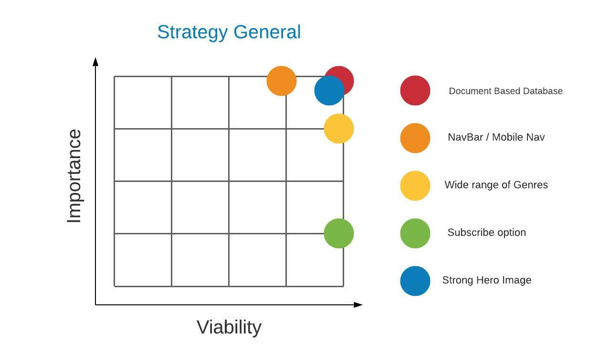
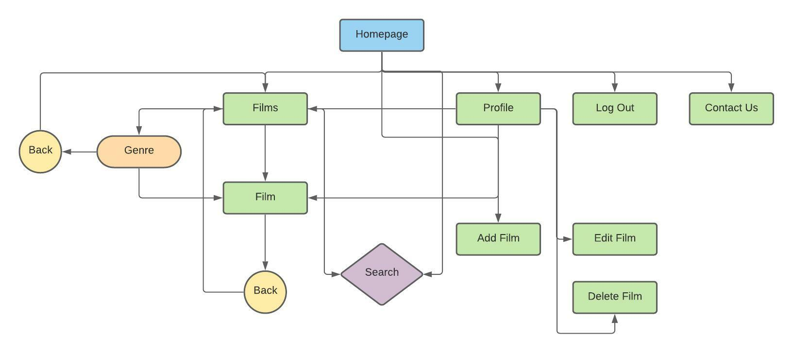
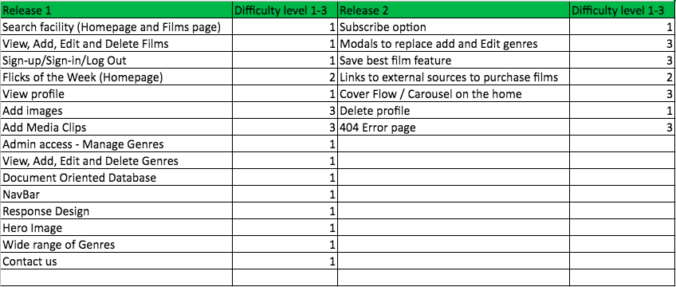

# FilmZone

## Code Institute - Milestone Project 3


<a href="https://filmzone-project.herokuapp.com/" target="_blank">Click here to view FilmZone live</a>

## Table of contents
1. [Introduction](#introduction)
    * [CRUD](#crud)
1. [UX](#ux)
    * [User demographic](#user-demographic) 
    * [Main aims](#main-aims)
    * [User Stories](#user-stories)
1. [Development Process](#development-process)
    * [Strategy](#strategy)
    * [Scope](#scope)
    * [Structure](#structure)
    * [Skeleton](#skeleton)
        * [Balsamiq Wireframes](#balsamiq-wireframes)
    * [Surface](#surface)
1. [Development Environment](#development-environment )
1. [Deployment](#deployment)
    * [Requirements](#requirements)
    * [Connect Flask to MongoDB Atlas](#connect-flask-to-mongodb-atlas)
    * [Clone project](#clone-project)
    * [Forking project](#forking-project)
1. [Design Process](#design-process)
    * [CSS custom styling](#css-custom-styling)
    * [Base Template](#base-template)
    * [Head](#head)
    * [Body](#body)
    * [Header](#header)
    * [NavBar](#navbar)
    * [Mobile SideNav](#mobile-sidenav)
    * [Footer](#footer)
    * [Homepage](#homepage)
    * [Films page](#films-page)
    * [Signup page](#signup-page)
    * [Login page](#login-page)
    * [Logout page](#logout-page)
    * [Profile page](#profile-page)
    * [Add Film page](#add-film-page)
    * [Edit Film page](#edit-film-page)
    * [Genres page](#genres-page)
    * [Add Genre page](#add-genre-page)
    * [Edit Genre page](#edit-genre-page)
    * [Contact Us page](#contact-us-page)
    * [Media Queries](#media-queries)
1. [Features](#features)
    * [Existing features](#existing-features)
    * [Features to implement](#features-to-implement)
1. [Technologies used](#technologies-used)
    * [Languages](#languages)
    * [Frameworks and Libraries](#frameworks-and-libraries)
    * [Other technologies](#other-technologies) 
1. [Testing](#testing)
1. [Bugs](#bugs)
1. [Credits](#credits)
    * [Images](#images)
    * [Content](#content)
    * [Code](#code)
    * [JavaScript](#javaScript)
1. [Acknowledgements](#acknowledgements)
1. [Notes](#notes)

___
[Back to top ⇧](#filmzone)

## Introduction
This Milestone project (Python and Data Centric Development) is the third of four that continues to contribute towards my Full Stack Web Developer Diploma with Code Institute. The main requirements in this project are to design a Full-Stack website that allows users to manage a common dataset about a particular domain. Users make use of the site to share their own data with the community, and benefit from having convenient access to the data provided by all other members. The site Administrator/owner will also be a regular visitor to the website and therefore has additional functionalities to the frontend and backend of the site. The site will of authentication in place for any user to sign up to their own account/profile and in turn contribute to the website by adding and editing whilst logged in. The main technologies that need to be used to achieve this is HTML, CSS, JavaScript with the option of using jQuery, Python + Flask, MongoDB and any other suitable libraries, external APIs and tools that will assist in building this Full-Stack website. 

### CRUD
One of the key aims is to make sure that users can Create, Read, Update and Delete (CRUD conventions) where needed to offer excellent interactive user experience. The project will deliver all of these conventions in the form: -

- **Create** will be classed as Adding a Film/Adding a Genre
- **Read** will be classed as viewing Films all signed users have added
- **Update** will be classed and editing a Film a user has added or for the Admin user to be able to edit a Genre
- **Delete** will be classed as deleting a Film a user has added of for the Admin user to be able to delete a Genre. The term 'Done' is also used in the profile page to accomplish delete. 

FilmZone is a friendly, easy to use Website for all film lovers to visit. Users can view another users' favourite films and add their own films by signing up to a user account with a username and password of their choosing. With a search facility available, users can quickly find a particular film based on Genre, Actor or Film name keyword. As a keen film lover, I thought of this idea based on my own experiences and thinking that it would be good to have a platform on the internet to tell others what my favourites films are and why. As users aren’t restricted to how many films they can add, I believe that with just a few registered users the library of films within Filmzone could quickly grow and therefore offers new users a broad range of Films to consider watching next.  

I used a core base template during development to keep the Header and Footer the same throughout the whole site for all users to see. The site will have three different types of users: - 

### User One: The logged out/unregistered user 
This user will be able to access the Homepage, Films page where all films added will be available to read. This page shows the Film name, Actors' names, Genre the film falls into, an Image of the film and the name of who added the film. There will also be a search facility Login page, Signup page and a Contact Us page available for users to make contact and comment. 

### User Two: The logged in user 
This user will be able to visit all pages User One has access to. Additionally, this user will have access to their own profile page where they can see all films added giving them the option to edit, delete and view each film. This user can at any point logout. A Contact Us page will be available for users to make contact and comment. 

### User Three: The Admin user 
This user will be able to visit all pages that User One and User Two has access to. Additionally, this user will have access to the Manage Genres page which gives them the option to Edit, Delete and Add a new Genre. NOTE: If a Genre is deleted, any films sitting in that Genre will be automatically allocated to the Genre called ‘Other’. This user can at any point logout. A Contact Us page will be available for users to make contact and comment. 

Date this project started: 23rd August 2021

___
[Back to top ⇧](#filmzone)

## UX 
### User Demographic 

- For film lovers who enjoy watching films on a regular basis  
- For anybody that is looking for a particular firm based on a genre type or actor name
- For film lovers that are interested in sharing their best films with others 
- For film lovers who prefer to watch films at home on their TV or device 
- For film lovers who have access to the internet via computer, tablet or mobile device. 

### Main Aims 

#### User Goals 

- Search for a Film based on Genre, Actor name or Film name keyword(s). 
- View all Films added by all users 
- View individual films added by all users 
- View the Homepage ‘Flicks of the week’ 
- User ‘sign-up’ option to login to own profile 
- Logged in users - Add a Film 
- Logged in users - Edit a Film 
- Logged in users - Delete a Film 
- **CRUD** conventions realised and achieved 
- Make contact with the site owner to comment, if required 

#### Developer/Site owner Website Goals 
- ‘Admin’ username and password login 
- Access to ‘Manage Genres’ 
- Add Genre 
- Edit Genre 
- Delete Genre 
- **CRUD** conventions realised and achieved 

#### Developer Aims 
- Create an interesting and easy to use website 
- A platform for Film lovers to use to Create, Read, Update and Delete Film Records 
- Demonstrate the use of front-end and back-end Web development languages recently learnt with CI.  
- Making sure that a non-relational database is used as part of the development for success in storing Users, Film Genres and Film records.  
- Successful deployment adding to the developer portfolio. 

### User Stories 
- A user that doesn’t have an account visits FilmZone and wants ideas on what film to watch for the evening. This user enjoys all types of Films and likes the Actor Al Pacino. 
- A registered user to FilmZone that has just watched a new Film and wants to offer a review for others to consider watching it.  
- A registered user that just finished watching their favourite Film. After which they want to update the Film record on FilmZone to show all site visitors more information i.e. More actors, a different image, a favourite scene change. 
- I’m a regular visitor to FilmZone and would be keen to gain access to my own profile to add my own favourite Films.  
- I have noticed that one of my Films I added last week is now in the ‘Other’ Genre when I originally allocated it to relevant Genre. How can I get feedback on this?
- The Developer/Site Owner sees that there is a quite a few Films being added by registered users into the ‘Other’ Genre category. Quick research shows that a new Genre(s) Category needs to be added to accommodate these Films.  
- Due to a News Report a Film Actor has been discredited and therefore all Films associated to this Actor needs to be removed from the Internet. 

___
[Back to top ⇧](#filmzone) 

### Development Process 
As this project is focused on full stack development and using a non-relational database more time was given to the preparation of the site based on UX Design, the five development planes, the document-oriented database and keeping a full focus on the user goals, developer goals and user stories found above.  

### Strategy 
I started with one overall Strategy where I focused on all users and the developer/site owner goals. 


This was to cluttered and didn’t fully show all goals in a structured way. I therefore broke down the Strategy part of the development into several categories (Unregistered Users, Registered Users, Admin User, General and Developer/Site Owner) 

Unregistered users need to be able to:-
- View Films 
- View ‘Flicks of the Week’ 
- Search for Films 
- Register an Account 
- Contact Us 

Registered users need to be able to:-
- Login with username and password 
- View Films 
- Add Films 
- Edit own Films 
- Delete own Films 
- Search for Films 
- Logout 
- Contact Us 

Admin user needs to be able to:-
- Login with username and password 
- View Films  
- Add Films 
- Edit own Films 
- Delete own Films 
- Search for Films 
- Access ‘Manage Genres’  
- Add a new Genre 
- Edit a Genre  
- Delete a Genre  
- Logout 

General 
- Logo 
- Navbar/Mobile Nav for smaller devices 
- Wide range of Genres 
- Strong Hero Image on the Homepage 
- Document Based Database (see below for details) 

Developer/Site Owner needs to be able to: 
- Access the Non-Relational Database connected to the site 
- View Genres 
- Add a new Genre 
- Edit a Genre 
- Delete a Genre 
- View Films 
- Add a new Film 
- Edit a Film 
- Delete a Film 
- View Users 
- Add a new User 
- Edit a User 
- Delete a User	 

With these goals in mind, I put together diagrams that shows the importance and Viability relevant to each type of user. 




[Back to top ⇧](#filmzone)

### Scope 
After looking at all possible users, features and user stories from my Strategy I made a list of what I wanted to include in the build of the site based on what features all users would want and how it would be possible to offer these features. I created two releases of the site with release one being the challenge for this project. Any features from release two would be considered for the next phase of this web application but unlikely to be included this time around.  

**Logged out or unregistered users**


**Logged in users**



**Logged in admin user**


**Scope overview**



[Back to top ⇧](#filmzone)

### Structure 

This website will hold at least **??10??** HTML web pages and therefore I wanted to make sure that all pages followed the same theme using CSS styling and Materialize (Responsive CSS Framework). What I focused on: -  

Navbar made specific to logged out, logged in and Admin users 

- Font size 
- Font styling 
- Colour themes  
- Row and Column Formatting 
- Card Panels 
- Consistency of links 
- Buttons 
- Accordion  
- Hero Image 
- Relevant icons 
- Internal links 
- Logo 
- Copyright 
- Instructions 
- Line breaks 

By maintaining a consistent theme throughout the website, I believe this would offer better overall UX for all visitors to the site. At this stage of the design process, I had a clear idea of what each page would have: - 

The Homepage will offer all users an immediate understanding about FilmZone with the Hero Image and content explanation. The search facility and Films below the Hero Image gives all users access to film recommendations which is the main focus of the site before users either login or signup. One other feature on this page is the ‘Flicks of the week’ which shows 2 or 3 popular films that were added that week. Once logged in, the Homepage Navbar will change slightly with the option to access a ‘Profile’ page and logout when required. 

The Films page will offer users the option to view all films. There is a search facility on this page as well giving users the option to narrow their search by Genre, Actor name and/or Film title. Again, the Homepage Navbar will change slightly with the option to access a ‘Profile’ page and logout when required. 

The Login page is designed for users to login to their account with a username and password which has already been setup. Once logged in users can navigate to the Homepage, Films page, profile page and when ready logout.  

The Sign-up page looks very similar to the Login page. It's designed for new users to sign-up by adding a username and password. Again, once logged in users can navigate to the Homepage, Films page, profile page and when ready logout. 

The Profile page is only available to registered logged in users. This page will only become relevant when a user adds Films to the site. The user can then View, Edit and Delete Films they have added. There is also a link to add new films on this page as well as in the Navbar at the top.  

The Add Film page is designed for users logged in who wish to add a new Film to the website and in turn to their account profile to edit or delete if and when required. There will be a cancel button in place in case the user decides not to add a new film and wants to return to their profile account. 

The Edit Film page looks very similar to the Add Film page. It’s designed for used logged in who wish to Edit a Film they have already added. There will be a cancel button in place in case the user decides not to edit the film and wants to return to their profile account. 

The Manage Genre page is only available to access for logged in Admin accounts. This section of the site is designed to ‘Manage Genres’. This page will hold all added Genres with the option to edit, delete and add new Genre categories. Deleting Genres can cause disruption to the films added to a Genre that’s been deleted. Therefore, I am looking to utilise the ‘Other’ Genre category to push any unallocated Films into ‘Other’. 

Add Genre page gives the admin user the option to add a new Genre to the database and website. There will be a ‘Cancel’ button available in case the admin user decides not to add. 

Edit Genre page will be very similar to the Add Genre page. The only difference is the admin user will need to override the current genre name and click ‘Edit Genre’ to make the change. Again, there will be a ‘Cancel’ button available in case the admin user decides not to edit. 

Contact Us page - TBC 

Structure screenshot 
{png here} 

[Back to top ⇧](#filmzone)

### Skeleton 

For this part of the design process, I used Balsamiq to sketch out all web pages based on what I want to achieve.

#### Balsamiq Wireframes

#### Please click <a href="https://github.com/liamwalsh1980/Milestone-Project-3/blob/master/static/images/ux/skeleton/wireframes/filmzone.pdf" target="_blank">PDF Wireframes </a> to see all versions 

As the developer of FilmZone I put a lot of work into making sure that the Wireframes were as close as possible to the finished site. There were a few differences which are highlighted below: -  

TBC 
___
[Back to top ⇧](#filmzone)

### Surface 

#### Colour Scheme 

I took inspiration from the hero image and using Chrome Dev Tools I was able to put together a colour pallet using cooler.co showing that the colours worked together.  

With the Hero Image photo taken at night time I thought it best to use a black shade background for the header and footer with a white background for the sections in between. Content would be written in a contrasting colour based on the background chosen throughout the website. For example, with a Dark background a white font colour will be used for good overall UX.   

Having particular shades of purple, orange, yellow and green colours available would help with making sure that the website had some character. A lot of the website is taken up using Card panels and images, therefore having other colours available is a must to make sure that card panels, images, forms and content would be visible and easy on the eye.  

FilmZone – Color Pallet


Please click <a href="https://coolors.co/030001-eae3ef-7c526d-d76848-e89549-f8c149-647737" target="_blank">here</a> to see selected colors from coolors.co

#### Typography 

After a little research into what fonts would work best for a website based on Films, I thought it best to have a unique, stand-out font for the title/logo of the site.  

The Logo – FilmZone is designed using the **Holtwood One SC** font sourced from Google Fonts.  

Holtwood is a bold display font developed for use with modern web browsers. It has a lot of the look of some traditional woodblock poster typefaces of the Nineteenth Century but updated for the Twenty First. Holtwood was envisioned to be used in big and bold text sizes, but it still works well when running as smaller headlines too. 

Example: -


The Font chosen for the main content is **Montserrat** again, sourced using Google Fonts and the ‘Pairings’ option to make sure that the **Holtwood One SC** font for the logo would work well with the **Montserra** font.

The Montserrat project is led by Julieta Ulanovsky, a type designer based in Buenos Aires, Argentina. The old posters and signs in the traditional Montserrat neighbourhood of Buenos Aires inspired Julieta Ulanovsky to design this typeface and rescue the beauty of urban typography that emerged in the first half of the twentieth century. As urban development changes that place, it will never return to its original form and loses forever the designs that are so special and unique. The letters that inspired this project have work, dedication, care, colour, contrast, light and life, day and night! These are the types that make the city look so beautiful. The Montserrat Project began with the idea to rescue what is in Montserrat and set it free under a libre license, the SIL Open Font License. 

Example:-


I believe that both fonts complement each other well and with the assurance of Google Fonts pairing both fonts together I know that the website will look attractive, eye catching and easy to read with the combination of good font choices and a strong colour pallet. 

#### Data Schema 

For Filmzone to work this project is based on backend development as well as frontend. With this in mind a Document-Oriented Database / NoSQL Database called MongoDB was created to store all data in three collections called users, films and genres. 


[Back to top ⇧](#filmzone)

#### Users Collection 

When a user creates an account, all information will be stored in the ‘users’ collection. 

- Username (Unique to the user and connected to ‘Created by’ field from the ‘users’ collection) 
- Password (Unique and secure for the user only) 
- _id (Auto-generated by MongoDB and connected to the ‘films’ and ‘genres’ collections) 

#### Films Collection 

Once signed in, a user can add a new Film. This is stored in the ‘films’ collection. 

- Film name (required) 
- Genre name (required) 
- Actors (required) 
- Favourite scene/Best Bit (required) 
- Image URL
- Media URL (no longer being used)
- Created by (Connected to the ‘username’ field - from the ‘users’ collection) 
- _id (Auto-generated by MongoDB and connected to the ‘users’ and ‘genres’ collections) 

#### Genres Collection 

The Database Genres collection will initially store 20 different film Genres.  


When the Admin user is signed in the Genres section can be amended with the options to add, edit and delete Genres. This is stored in the ‘genres’ collection.  

- Genre name (Connected to the ‘Genre name’ field from the ‘films’ collection) 
- _id (Auto-generated by MongoDB and connected to the ‘users’ and ‘films’ collections) 

___
[Back to top ⇧](#filmzone)

## Development Environment 

Within Github I opened a ‘new’ repository and included the Code Institute full template. The New repository will be called liamwalsh1980/Milestone-Project-3 with a brief description of the new application which can be seen below: - 

> A fun and interactive website for Film lovers to sign in and add film reviews and read about other members film recommendations. 

- I then clicked ‘Gitpod’ to open the workspace up.

- I started by installing Flask in the command line using the command $ pip3 install Flask 

Then I added the following new files: - 

- app.py using the command touch app.py (this will be for writing Python code
- env.py using the command touch env.py (this will be for hiding sensitive data) 
- .gitignore should already be created based on the CI template installed when creating the repository. Within the file the env.py file should be added along with the __ pycache __ directory that will be auto-generated shortly.  

Inside the env.py file I added the following: -

- Import os (set our default environment) 

___
[Back to top ⇧](#filmzone)

## Deployment 

### Requirements
- Github
- Heroku
- MongoDB
- Python3

To deploy this application there were tasks to complete in both the Git command line and Heroku.  

### Heroku and Github

Heroku is a platform as a service (PaaS) that enables developers to build, run, and operate applications entirely in the cloud. 

Before deployment can be completed on Heroku I completed the following steps in the Git terminal.  

A requirments.txt file and Procfile file was created using the command-line.  
- $ pip3 freeze –local > requirements.txt 
- $ echo web: python app.py > Procfile
>I removed the blank line below the Procfile as this could cause issues later on in the project

Within the command-line, Commit and Push both files to the repository 

- $ git add requirements.txt 
- $ git commit –m “requirement.txt file added” 
- $ git add Procfile 
- $ git commit –m “Procfile added” 
- $ git push 

In Heroku create a new App called ‘filmzone-project’ 

To connect the App, I used the ‘GitHub’ ‘Connect to GitHub’ option. This is the process done by Automatic Deployment from the GitHub repository – ‘Milestone-Project-3'. Once found click ‘connect’ to this App. 

Before clicking ‘Enable Automatic Deploy’ I made sure that the hidden environment variables within env.py file is added within Heroku. Go to ‘Settings’ and then click ‘Reveal Config Vars’ to add the following: -  


(passwords are removed for security)

Return to the Deploy section and click ‘Enable Automatic Deployment’ and with the Main branch in place click ‘Deploy Branch’. Heroku will then receive the code from GitHub and the app will start being built using the required packages. Once this is completed the message ‘Your App was successfully deployed’ will be shown. 


Click ‘View’ to launch the new app in a browser.  

[Back to top ⇧](#filmzone)

### Connect Flask to MongoDB Atlas

Flask is a micro web framework written in Python. In order to wire up Flask to MongoDB Atlas the ‘flask-pymongo’ library needs to be installed using the Git command-line. The commands are: - 

- $ pip3 install flask-pymongo (Optimized to work with flask) 
- $ pip3 install dnspython (Mongo SRV connection string) 

After this I updated the requirements.txt file so that Heroku knows that there is a required for more to run the app. The command is: - 

- $ pip3 freeze –local > requirements.txt 

Once configuration coding is added on the app.py file I then retrieved the MONGO_URI connection string from Heroku with the following steps: - 

- Click ‘Overview’ 
- Click ‘Connect’ 
- Select ‘Connect your application’ 
- Select ‘Python’ for driver  
- Select the latest version (for me it was ‘3.12 or later’) 


(passwords are removed for security) 

- Copy the string using the icon on the righthand side of the string.  
- Paste this as the second argument inside the app.py file for the MONGO URI and then paste it in the Config Vars in Heroku.  


(passwords are removed for security)

Back in the app.py file add the following instance of PyMongo 

- mongo = PyMongo (app) 

Then demonstrate its working using the @app.route decorator. 

- @app.route (“/get_films”) changing the current function name to ‘get_films()’

At the top of the app.py file in addition to the Flask import function add the following to be used later on in the project: - 

- flash 
- render_template 
- redirect 
- request 
- session 
- url_for 

With the render_template imported I updated the @app.route decorator and get_films() to show the following: 


Within the command-line I then created a new directory called ‘templates’ and then added a new file called films.html inside this directory. 

Inside the new films.html template I added a standard boiler plate using the html:5 shortcut, added the name “FilmZone” as a title and created a for loop using the Jinja templating language to iterate through all films using a new variable called film.  

Inside this for loop I then added each field that’s connected with the films collection in MongoDB using dot notation. For example:  

- {{ film.film_name }} 

To test all is working I opened the file using the command-line with the command 

- $ python3 app.py 

___
[Back to top ⇧](#filmzone)

### Clone project

___
[Back to top ⇧](#filmzone)

### Forking project

___
[Back to top ⇧](#filmzone)


## End of deployment 

___
[Back to top ⇧](#filmzone)

## Design Process  

### CSS custom styling 
At the top of my custom CSS file, I added the import URL for the chosen, fonts from Google Fonts. These fonts again for reference are Holtwood One SC for the text logo and Montserrat for the rest of the website.  

I then set the default values to zero for margin, padding and border. Within the body of all templates the following defaults were set: - 

> font-family: 'Montserrat', sans-serif;<br>
> color: #EAE3EF;<br>
> background-color: #030001;

### Base Template
I designed a base.html file to act as the parent template which will contain all main references and third-party libraries. All child templates will then be able to inherit everything from this parent template using Jinja templating language blocks. This follows the philosophy of ‘DRY’ - Don’t' repeat yourself as templating will help avoid duplication and saves me time. I chose to use the block name of ‘content’ and to avoid any silent errors, I made sure that the block name of ‘content’ was used consistently throughout the project. 

What is included is the header with navbar and footer. More information below for reference. 

### Head 
Only within the base template, I used a standard boilerplate in the header using the shorthand code of html:5 and clicking enter. This launched the standard boiler plate needed for all html templates to inherit. I made sure that all link elements and CDN’s were added in reference to Font Awesome for icons, Materialize for responsive design and my own custom CSS template was in place ready for adding my own styling throughout the project. I also added the following Jinja code so I could add my own custom styles that are applied from one of the child templates in the project.  

><br>
> 

### Body 
At the bottom of the body element, I added the script tags for external usage of Materialize and jQuery. I finished with adding my own custom script enabling me to write my own JavaScript/jQuery code when required. The Jinja code below was also added so I could add my own custom scripts that are applied from one of the child templates in the project. For reference instead of using Vanilla JavaScript jQuery was mainly used instead.  

><br>
> 

[Back to top ⇧](#filmzone)

### Header 

The header and footer within the body of the base.html file is structured for consistency across the whole application using Jinja Templating Language code.

><br>

    [HTML FOR EACH PAGE TO BE ADDED HERE]

><br>
> 

### Navbar 

I decided to position the ‘FILMZONE’ text logo on the left side of the Navbar in the chosen font of Holtwood One SC. I added a ‘Film’ icon from Font Awesome that is positioned to the left of the text logo. When hovering over the text logo the user will see that this changes colour to indicate that it can be clicked and doing so will return the user to the homepage at any time. The page links are positioned on the right side of the Navbar. I made sure the font for these links remained the same as the default setup at the beginning of my CSS custom styling file. As a reminder this font is called Montserrat. 

### Mobile SideNav

On smaller devices users will not see the main navbar. Instead, there is a ‘Hamburger Menu’ icon on the right-hand side. When clicking this icon, the user will see the full list of web pages available to them in the form of a dropdown menu. The ‘FilmZone’ text logo and ‘Film’ Icon is still shown at the top of this menu for good UX where users can navigate to any page they want just as easily as being on a bigger screen.  

Depending on the user, they will see the following Navbar options: - 

Unregistered/Signed out users (Home | Films (with dropdown menu) | Login | Signup | Contact Us) 

Login users (Home | Profile | Films (with dropdown menu) | Add Films | Logout | Contact Us) 

Login Admin users (Home | Profile | Films (with dropdown menu) | Add Films | Manage Genres | Logout | Contact Us) 

| Signed out | Logged in  | Admin Logged in |
| ---------- |:-----------| ----------------|
| Home       | Home       | Home            |
| Films      | Films      | Films           |
| Login      | Profile    | Profile         |
| Signup     | Add film   | Add Film        |
| Contact us | Logout     | Manage Genres   |
|            | Contact us | Logout          |
|            |            | Contact us      |
|            |            |                 |

To finish, I applied the class ‘navbar-fixed’ inside a div element which is wrapped around the navbar code to fix it to the top of the all webpages whenever a user scrolls down a page. This offers good UX for users to be able to navigate to another page at any point throughout their experience on the site.  

[Back to top ⇧](#filmzone) 

### Footer  

With the footer added from the base.html file, each page footer is the same. This is designed for consistency and styling using the Materialize CSS framework. I chose a bright orange colour background from my chosen pallet to separate the colours to show good styling and usage of my pallet. The footer includes the Copyright icon connected to FilmZone and social media icons. I also added links to the footer which changes depending on whether a user is logged in or not. If a user is logged in, they will see links for ‘Homepage’, ‘Films’, ‘Profile’ and ‘Contact Us’. Logged out user will see all links except for the ‘Profile’ link. Instead, they will see a ‘Signup’ link. I used an ‘if’ statement and Jinja code to achieve this.  

>More to come - an image is to be added to the right of the links

### Homepage

Also known as the index.html template, I started by adding a sub header “We all love a good film” to the top centre of the page. Below is a hero image of a movie theatre at night. This blends well into my default colour background colour with bright, eye-catching colours within the image. Below is a short paragraph about FilmZone and a strip line with a link to encourage users to ‘signup’. If a user is logged in, the short paragraph is a ‘welcome’ message and the strip line link is to click to add a film. Again, I used an ‘if’ statement and Jinja code to achieve this. 

>More to come – search bar, flicks of the week and potentially a carousel.  

### Films page 

This page 'films.html' is for the purpose of holding all films added by all logged in users as a central page for everyone to view. Whether your logged in or not you will be able to access this page. The head and footer are identical to the rest of the site by using the Jinja templating language. Within the body of the page i added a subheader called 'Films' and below is a 'for' loop iterating through films which is the function name in my app.py file. The user will see all films added by all users. The layout will be as follows: -

- Film name
- Genre type
- Actor names
- Best bit
- Image of the film
- Created by (Horizontal lines above and below highlighting the field)

The function in my app.py file finds and sorts the list of films from the database and presents all films alphabetically. On smaller screens each film is positioned one on top of another in the form of a list to scroll down. On bigger screen sizes i am hoping for the films to be positions in rows of either two or three depending on what looks best for the user. 

This page is purely for viewing films already added and therefore covers the 'R' for read based on the CRUD convention. 

[Back to top ⇧](#filmzone)

### Signup page 

To build a signup page for users to login via username and password and to provide secure user authentication, I used Werkzeug which is one of the Flask dependencies. I started by importing two main helpers into my application python file, app.py.  

- generate_password_hash
- check_password_hash 

In my app.py python file I started building the functionality for the ‘signup’ template making sure that both the GET and POST methods are included within the parentheses of the @app.route decorator.  

After creating the new ‘signup’ template using the command-line in my workspace I then used Materialize to find the right card-panel, form elements for ‘username’ and ‘password’ and submit button. Once this was completed and I then styled this page in line with the colours and fonts I'm using throughout the project. I used Font awesome for relevant icons for the ‘username’, ‘password’ and ‘submit’ button.  

I then connected the relevant navbar links to the new ‘signup’ template using the ‘url_for’ flask dependant which was already imported at the top of the app.py file. I also made sure to add the link to the main navbar and side mobile navbar. 

Within the input elements for the ‘username’ and ‘password’ rows, I made sure that that the ‘id’, ‘name’ and ‘for’ attributes all had the same relevant values I.e., ‘username’ for username and ‘password’ for password. I also added the following attributes to make sure that usernames and passwords were added with no spaces or irregular characters.  

- minlength=”5” 
- maxlength=”15’ 

To finish I added the ‘required’ attribute so that if a user didn’t enter a sufficient username and/or password they would see an error message ‘Please fill in this field’. 

For more defensive programming I added a property called ‘pattern’ within the input elements for the ‘username’ and ‘password’ rows. This attribute allows me to apply Regular Expressions (RegEx). This restricts the new user to adding a username with just lowercase letters, uppercase letters or numbers. i.e., a-z A-Z 0-9.  

I decided to add some instructions in small font below for both the username and password areas of the form. This gives users clear instructions on making sure to only add a username and password with alpha-numeric characters, no less than 5 and no more than 15.  

The button to signup has a different colour background to standout with covers the full length of the card panel at the bottom.  

With if/else statements added within the signup function in the app.py file, I was able to add Flash messages to indicate to users if the username added already exists or whether signup is successful. Either of these messages show at the top of the signup template once the user adds a username and password and clicks the submit button. 

Underneath the button element I added a new ‘row’ inside a div element to add a small paragraph saying, ‘Already have an account? Login Here’ with an internal link to the ‘Login’ page if the user already has a username and password. 

### Login page 

I started by duplicating the signup.html template and calling the new template, login.html. Inside this template I made adjustments to the following code that was duplicated from the signup template: - 

- Sub header text was changed to ‘Login’ 
- Internal link at the top of the form within the method attribute is changed to ‘login’ 
- Username icon changed to a user cog 
- Comment-out text changed to ‘Login’ form and ‘Login’ button 
- Button text changed to ‘Login’ 

Underneath the button element I added a new ‘row’ inside a div element to add a small paragraph saying, ‘New here? Signup’ with an internal link to the ‘Signup’ page if they haven’t registered an account.  

I then built the functions in the app.py python file for both the Signup and Login pages. 

The function name for the signup page is ‘signup’ and using the GET and POST methods, if/else statements, session cookies, flash messages, Werkzeug library generate_password_hash helper, ‘redirect’ function from Flask and ‘render_template’ from Flask. 

The function name for the login page is 'login' and using the GET and POST methods, if/else statements, session cookies, flash messages, Werkzeug library check_password_hash helper, ‘redirect’ function from Flask and ‘render_template’ from Flask. 

I tested the ‘Signup’ and 'Login' templates together by registering a new username and password and then signing in with correct and incorrect username/password credentials. All scenarios tested successfully.  

[Back to top ⇧](#filmzone) 

### Logout function 

I added a python function called ‘logout’ in the app.py file for users to be able to successfully log out of their account by click the ‘logout’ link on the navigation bar of the web application. The function uses the app.route decorator, session.pop(“user”) method to remove the user from the cookie session and log them out. I also included a flash message to indicate to the user they have logged out successfully and the redirect import to return users to the login page.  

>Note: Instead of using the session.pop(“user”) method I considered using the session.clear() but this I think wouldn’t work as well as this removes all session cookies applicable to the application. 

With the signup, login and logout functions now in place and working I felt I needed to show only relevant links on the navigation bar based on whether the user is signed in to their account or not. I used the Jinja templating language to apply templating logic to the navbars. In the base.html template and within the navbars I positioned a Jinja if statement for the ‘session.user’ so that users that aren’t logged in will only see the Homepage, Films page, Login page, Signup page and Contact Us page within the navbars. If a user is signed in to their account, they will be able to see on the navbars the Homepage, Films page, Profile page, Add Films page, Logout page and Contact Us page. If an ‘Admin’ user Is logged in, they will be able to see the Manage Genres page as well.  

### Profile page 

I started this page by duplicating the login.html template and calling the new page profile.html. Inside this new template I used Jinja code to extend the base.html template. I then added Sub header section with Jinja code to show the logged in username at the top i.e.  

>{{ username }}’s Films 

If Johnsmith is logged in they will be presented on their profile page like this: - 

>Johnsmith’s Films

Underneath and to the right side there is a text link called ‘Add New Film’ this has a font awesome ‘plus’ icon next to it. I gave this a colour of copper red from my pallet and a bottom border to stand out, making it visible for users to see and click on. This link will take users to the add film page.  

Below I added a new section where I setup a Materialize collapsible unordered list also known as an accordion. Each field will have a film that has been added by the user and an ‘Edit’ and ‘Delete’ button for just the logged in user to update and delete if required.

I then added a new function called profile(username) in my app.py python file. Using the app.route decorator, this function includes the GET and POST methods, username session cookie called ‘user’, return render_template to the user's profile along with return redirect to the login page if the user fails to login successfully. Effectively, this function grabs the session user’s username from the database.  

This page is for viewing, editing and deleting films already added and therefore covers the R','U' and 'D' based on the CRUD convention. 

R = Read for viewing the films added by the user logged in 
U = Update for editing any film added by the user logged in
D = Delete for deleing any film added by the user logged in

### Delete function

I added a python function called 'delete_film' in the app.py file for users to be able delete only the films they have added by clicking the 'Done' button within their profile page. The function uses the app.route decorator with the film_id from MongoDB in parentheses. By using the .remove method, the _id from MongoDB, ObjectId from MongoDB with the film_id inside curly brackets, users are able to remove (delete) any film they have added. I also included a flash message to indicate to the user that the film they wanted to remove has been successfully deleted. The flash message displays in the 'Films' page as this is where the user is taken after the film is deleted. I used the redirect import to achieve this.

>Note: Instead of using the session.pop(“user”) method I considered using the session.clear() but this I think wouldn’t work as well as this removes all session cookies applicable to the application. 

With the signup, login and logout functions now in place and working I felt I needed to show only relevant links on the navigation bar based on whether the user is signed in to their account or not. I used the Jinja templating language to apply templating logic to the navbars. In the base.html template and within the navbars I positioned a Jinja if statement for the ‘session.user’ so that users that aren’t logged in will only see the Homepage, Films page, Login page, Signup page and Contact Us page within the navbars. If a user is signed in to their account, they will be able to see on the navbars the Homepage, Films page, Profile page, Add Films page, Logout page and Contact Us page. If an ‘Admin’ user Is logged in, they will be able to see the Manage Genres page as well.  

[Back to top ⇧](#filmzone) 

### Add Film page 

Before I started designing the ‘add film’ template I made sure that all film genres were added according to my Data Schema, Genre collections and matches to the MongoDB created earlier on this project. I then created a new html template called ‘add_film’ for all signed in users to add a film to the website. This is part of the CRUD convention and specific to ‘C’ for create i.e., adding/creating a new film. I applied the Jinja templating language for extending the base template and block content as normal and below that added a subheader ‘Add Film’. I then created a form for users to complete in order to add a film which would be on both the ‘Films’ page and the users profile page for editing/removing. The form consists of the following: - 

- Genre Name (Choose from list). This section of the form is a dropdown menu with pre-populated genres already added. The user just needs to select the relevant genre. This field is mandatory and without selecting a genre will mean that the ‘add film’ request cannot be submitted. 

>JavaScript added – more to come.

- Film Name. This is a text input field for users to complete with minimum (1 characters) and maximum (100 characters) attributes in place to keep the input from a user within reason. I included the ‘required’ attribute to make sure that users knew this field needed to be completed in order for a film to be to successfully added. 

- Actors Names. This is a text input field for users to complete with minimum (3 characters) and maximum (100 characters) attributes in place to keep the input from a user within reason. I included the ‘required’ attribute to make sure that users knew this field needed to be completed in order for a film to be to successfully added. 

- Best Bit. This is a text area for users to complete with a minimum (5 characters) and maximum (100 characters) attributes in place to keep the text content from a user within reason. I included the ‘required’ attribute to make sure that users knew this field needed to be completed in order for a film to be to successfully added. 

- Image URL. This is a text input field for users to complete. It has a ‘URL’ type attribute and with restricted character requirements (https://) using the pattern attribute.  

I was looking to add another section within this form for users to add a media clip. However, due to lack of time to format this I decided to leave it out and mark it as a future feature. 

At the bottom of the form there is a ‘Add Film’ button for users to click to add a film.

All of the above fields have a relevant icons positioned to the left of fields and inside and to the right of the add button. All icons were sourced from Font Awesome.

In the base template i added the link for this pahe to the Main Navbar and Mobile Navbar making sure its positioned within the if statement only for logged in users. This was achieved using conditional validation and Jinja templating language. 

### Edit Film page 

A started designing this page by duplicating the Add Film template and then made a few small changes. The subheader content changed to 'Edit Film' and using a for loop i was able to prefix the fields based on which film is being edited. See below.

Edit Genre name
-  - 'For' Loop to iterate through all Genres
-  - If Statement to confirm genre name is strictly equal to film name
{- else} - Else statement if genre name isn't strictly equal to film name

Edit Film name
- {{ film.film_name }} - Grabs the current film name based on which film is selected

Edit Actor names
- {{ film.actors }} - Grabs the current actors names based on which film is selected

Edit Best Bit added by user
- {{ film.best_bit }} - Grabs the current comments made by the user that's added the film 

Edit Image URL
- {{ film.image }} - Grabs the current URL for the image of the film being edited

Below are two buttons for the user click on. The first being 'Edit Film' which sends all the new data to the MongoDB and in turn updates the film information in the 'Films' template. The second button is to cancel the edit option and return the user to their Profile. Both buttons are large and stand out from the edit form for good and clear UX. Both buttons also have a relevant icon to the right showing what the buttons represent. The icons are sourced from Font Awesome. 

This page is for editing films already added and therefore covers the 'U' for update based on the CRUD convention. 

### Genres page 

I started by creating a new html template called ‘genres.html’ for the purpose of storing all Genres in the form of cards. I added a subheader at the top of the page with the title of ‘Genres’. With the help of Materialize and my own custom styling I created a basic card. With some Jinja code I created a for loop to iterate through all Genres from MongoDB creating a card for each genre. Within each card I added a button for editing and a button for deleting.  

In the base template I added the link for this page to the Main Navbar and Mobile Navbar. However, in order to make sure that this page is only accessed by the ‘Admin’ user I added some conditional validation using Jinja code ‘if statement’ making sure to close the ‘if statement’ after the genres.html link.  

[Back to top ⇧](#filmzone)

### Add Genre page 

### Edit Genre page 

[Back to top ⇧](#filmzone)

### Contact Us page 

### Media Queries 

____
[Back to top ⇧](#filmzone)

## Features 
### Existing features 
### Features to implement  

____
[Back to top ⇧](#filmzone)

## Technologies used 
### Languages 
- HTML5
- CSS3
- JavaScript
- Python3

### Frameworks and Libraries 
-  Materialize CSS (Version 1.0.0). A modern responsive front-end framework based on the Material Design philosopher developed in 2014 by Google which helps you build a stylish and responsive application. 
### Other technologies 
-  RandomKeygen 
-  Heroku is a platform as a service (PaaS) that enables developers to build, run, and operate applications entirely in the cloud. 
-  Werkzeug. A comprehensive WSGI (Web Server Gateway Interface) web application library. It began as a simple collection of various utilities for WSGI applications and has become one of the most advanced WSGI utility libraries. 
____
[Back to top ⇧](#filmzone)

## Testing
Testing information can be found in a separate 
[Testing document](TESTING.md)

____

## Bugs
Bugs – see JavaScript note for ‘dot’ bug on the add film template 
____
[Back to top ⇧](#filmzone)

## Credits

### Images
### Content
### Code
### JavaScript
____
[Back to top ⇧](#filmzone)

## Acknowledgements

## Notes

____
[Back to top ⇧](#filmzone) 

# End of Readme Documentation


Welcome Liam Walsh,

This is the Code Institute student template for Gitpod. We have preinstalled all of the tools you need to get started. You can safely delete this README.md file, or change it for your own project. Please do read it at least once, though! It contains some important information about Gitpod and the extensions we use. The last update to this file was: **July 2, 2021**

## Gitpod Reminders

To run a frontend (HTML, CSS, Javascript only) application in Gitpod, in the terminal, type:

`python3 -m http.server`

A blue button should appear to click: _Make Public_,

Another blue button should appear to click: _Open Browser_.

To run a backend Python file, type `python3 app.py`, if your Python file is named `app.py` of course.

A blue button should appear to click: _Make Public_,

Another blue button should appear to click: _Open Browser_.

In Gitpod you have superuser security privileges by default. Therefore you do not need to use the `sudo` (superuser do) command in the bash terminal in any of the lessons.

To log into the Heroku toolbelt CLI:

1. Log in to your Heroku account and go to *Account Settings* in the menu under your avatar.
2. Scroll down to the *API Key* and click *Reveal*
3. Copy the key
4. In Gitpod, from the terminal, run `heroku_config`
5. Paste in your API key when asked

You can now use the `heroku` CLI program - try running `heroku apps` to confirm it works. This API key is unique and private to you so do not share it. If you accidentally make it public then you can create a new one with _Regenerate API Key_.

------

## Release History

We continually tweak and adjust this template to help give you the best experience. Here is the version history:

**July 19 2021:** Remove `font_fix` script now that the terminal font issue is fixed.

**July 2 2021:** Remove extensions that are not available in Open VSX.

**June 30 2021:** Combined the P4 and P5 templates into one file, added the uptime script. See the FAQ at the end of this file.

**June 10 2021:** Added: `font_fix` script and alias to fix the Terminal font issue

**May 10 2021:** Added `heroku_config` script to allow Heroku API key to be stored as an environment variable.

**April 7 2021:** Upgraded the template for VS Code instead of Theia.

**October 21 2020:** Versions of the HTMLHint, Prettier, Bootstrap4 CDN and Auto Close extensions updated. The Python extension needs to stay the same version for now.

**October 08 2020:** Additional large Gitpod files (`core.mongo*` and `core.python*`) are now hidden in the Explorer, and have been added to the `.gitignore` by default.

**September 22 2020:** Gitpod occasionally creates large `core.Microsoft` files. These are now hidden in the Explorer. A `.gitignore` file has been created to make sure these files will not be committed, along with other common files.

**April 16 2020:** The template now automatically installs MySQL instead of relying on the Gitpod MySQL image. The message about a Python linter not being installed has been dealt with, and the set-up files are now hidden in the Gitpod file explorer.

**April 13 2020:** Added the _Prettier_ code beautifier extension instead of the code formatter built-in to Gitpod.

**February 2020:** The initialisation files now _do not_ auto-delete. They will remain in your project. You can safely ignore them. They just make sure that your workspace is configured correctly each time you open it. It will also prevent the Gitpod configuration popup from appearing.

**December 2019:** Added Eventyret's Bootstrap 4 extension. Type `!bscdn` in a HTML file to add the Bootstrap boilerplate. Check out the <a href="https://github.com/Eventyret/vscode-bcdn" target="_blank">README.md file at the official repo</a> for more options.

------

## FAQ about the uptime script

**Why have you added this script?**

It will help us to calculate how many running workspaces there are at any one time, which greatly helps us with cost and capacity planning. It will help us decide on the future direction of our cloud-based IDE strategy.

**How will this affect me?**

For everyday usage of Gitpod, it doesn’t have any effect at all. The script only captures the following data:

- An ID that is randomly generated each time the workspace is started.
- The current date and time
- The workspace status of “started” or “running”, which is sent every 5 minutes.

It is not possible for us or anyone else to trace the random ID back to an individual, and no personal data is being captured. It will not slow down the workspace or affect your work.

**So….?**

We want to tell you this so that we are being completely transparent about the data we collect and what we do with it.

**Can I opt out?**

Yes, you can. Since no personally identifiable information is being captured, we'd appreciate it if you let the script run; however if you are unhappy with the idea, simply run the following commands from the terminal window after creating the workspace, and this will remove the uptime script:

```
pkill uptime.sh
rm .vscode/uptime.sh
```

**Anything more?**

Yes! We'd strongly encourage you to look at the source code of the `uptime.sh` file so that you know what it's doing. As future software developers, it will be great practice to see how these shell scripts work.

---

Happy coding!
