# FilmZone

## Code Institute - Milestone Project 3 (Testing)

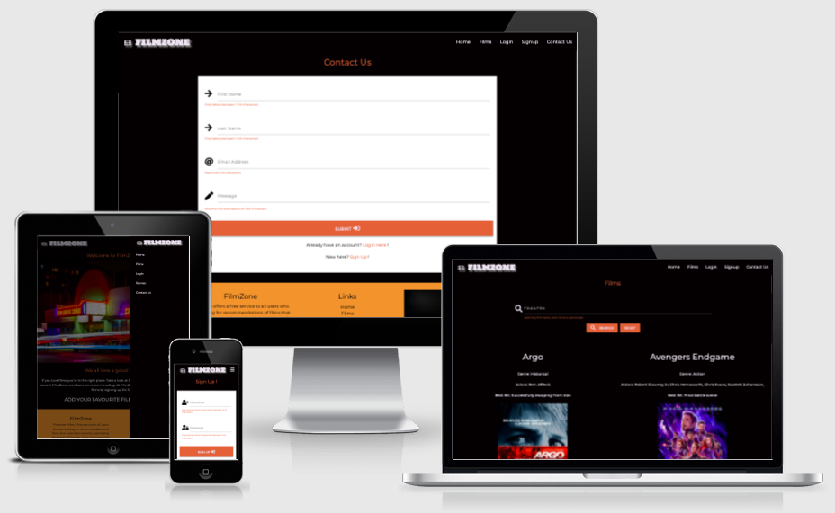

<a href="https://filmzone-project.herokuapp.com/" target="_blank">Click here to view FilmZone live</a>

## Table of contents

1. [Testing](#testing)
    * [Screen sizes](#screen-sizes)
        * [Large screens](#large-screens)
        * [Small screens](#small-screens)
    * [Navigation bar menu](#navigation-bar-menu)
        * [Full screen navigation bar](#full-screen-navigation-bar)
        * [Hamburger navigation bar](#hamburger-navigation-bar)
    * [User stories tested ](#user-stories-tested)
        * [Story 1](#story-1)
        * [Story 2](#story-2)
        * [Story 3](#story-3)
        * [Story 4](#story-4)
        * [Story 5](#story-5)
        * [Story 6](#story-6)
    * [W3C Markup Validation Service](#w3c-markup-validation-service)
        * [Base template tested](#base-template-tested)
        * [Homepage tested](#homepage-tested)
        * [Films page tested](#films-page-tested) 
        * [Signup page tested](#signup-page-tested)
        * [Login page tested](#login-page-tested)
        * [Profile page tested](#profile-page-tested)
        * [Add Film page tested](#add-film-page-tested)
        * [Edit Film page tested](#edit-film-page-tested)
        * [Genres page tested](#genres-page-tested)
        * [Add genre page tested](#add-genre-page-tested)
        * [Edit genre page tested](#edit-genre-page-tested)
        * [Contact Us page tested](#contact-us-page-tested)
    * [W3C CSS Validation Service](#w3c-css-validation-service)
        * [CSS coding tested](#css-coding-tested)
    * [JS Hint Javascript code validator](#js-hint-javascript-code-validator)
        * [Maps.js](#maps.js)
        * [Quiz.js](#quiz.js)
        * [sendEmail.js](#sendemail.js)
    * [Web Browsers](#web-browsers)
        * [Google Chrome](#google-chrome)
        * [Apple Safari](#apple-safari)
        * [Microsoft Edge](#microsoft-edge)
        * [Mozilla Firefox](#mozilla-firefox)
    * [Testing responsiveness](#testing-responsiveness)
        * [Mobile screenshots](#mobile-screenshots)
        * [Tablet screenshots](#tablet-screenshots)
        * [Desktop screenshots](#desktop-screenshots)
        * [Large Desktop screenshots](#large-desktop-screenshots)
    * [Lighthouse testing](#lighthouse-testing)
        * [Desktop results](#desktop-results)
        * [Mobile results](#mobile-results)
    * [Issues found](#issues-found)
        * [API key](#api-key)
        * [Quiz images](#quiz-images)
        * [Feedback form](#feedback-form)
        * [Modal issues](#modal-issues)
        * [EmailJS](#emailjs)
    * [Further testing](#further-testing)
        * [Mobile first](#mobile-first)
        * [External links](#external-links)
        * [Internal links](#internal-links)
    * [Bugs outstanding](#bugs-outstanding)

Return to my [README.md](README.md) 

[Back to top ⇧](#filmzone)

## Testing

I decided to use the Materialize CSS grid (rows and columns) to structure the website offering good UX on all screen sizes. With this in mind the Laptop and Desktop screens (large) layout is different to tablet and mobile screens (small) on many pages. For example, on the Films page users can see 2 films side by side on bigger screens and 1 on smaller screen sizes.  

#### Large screens
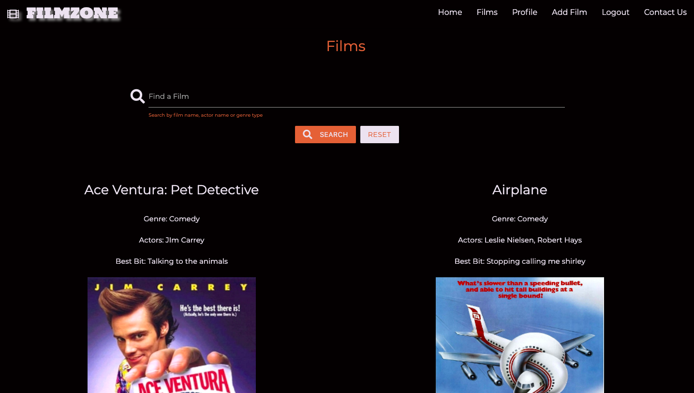

#### Small screens
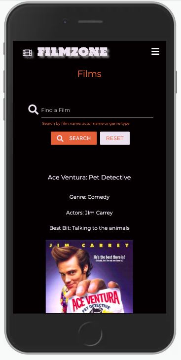

### Navigation bar menu
#### Full screen navigation bar
On big screens the navigation bar has page titles. Any page title that's hovered over changes color to indicate its a clickable link. I testing different styles for the Navbar however, i wanted to keep it clean and tidy. At one stage the 'Films' link was a dropdown menu giving users the option to click a film based on Genre. I decided to remove this feature for now to keep the navbar simple and easy to use. I added a search facility on the 'Films' page instead to make it easy for users to find a specific film based on Genre type. 

##### Logged out users

##### Logged in users

##### Logged in Admin user

#### Hamburger navigation bar
When testing the navigation bar I wanted to make sure that it collapses into a hamburger menu (3 horizontal bars) on smaller screens. This is common practice to have and offers the user the option to look and click onto another page within the website. I made sure that the FilmZone logo and icon was shown at the top of the hamburder menu when a user opens the navnar on a smaller screen like a mobile or tablet. 

##### Logged out users
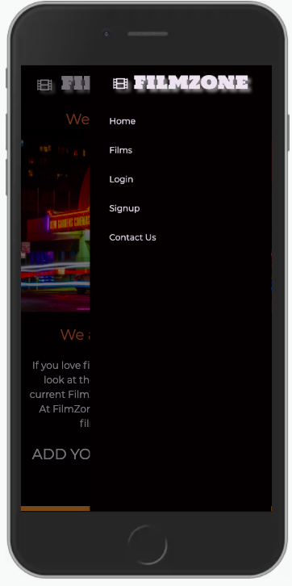

##### Logged in Admin user
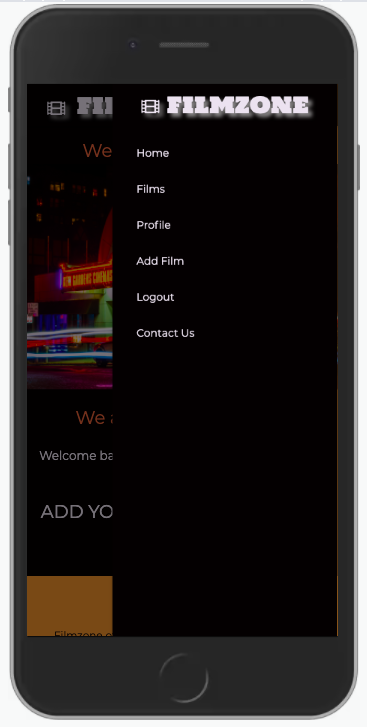

##### Logged in Admin user
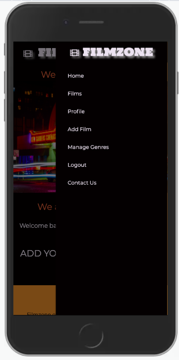

### User Stories tested
#### **Story 1**
A user that doesn’t have an account visits FilmZone and wants ideas on what film to watch for the evening. This user enjoys all types of Films and likes the Actor Al Pacino. 
- FilmZone: If the user navigates to the 'Films' page and use the Search Facility to look up films with Al Pacino staring by typing in the search facility 'Al Pacino'. 

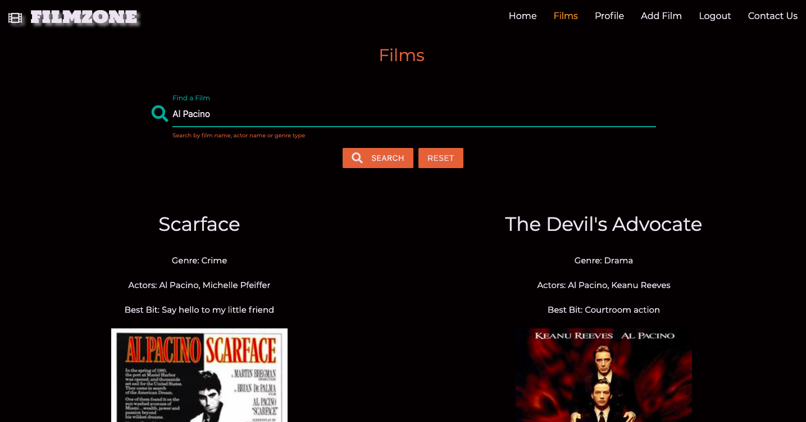

#### **Story 2**
I'm a registered user to FilmZone and I've just watched a new Film and want to offer a review for others to consider watching it.
- FilmZone: This user can login to their account/profile and then click the 'Add Film' from the Navbar or 'Add New Film' link from the profile page to then enable the option to add the new Film they have just watched. 

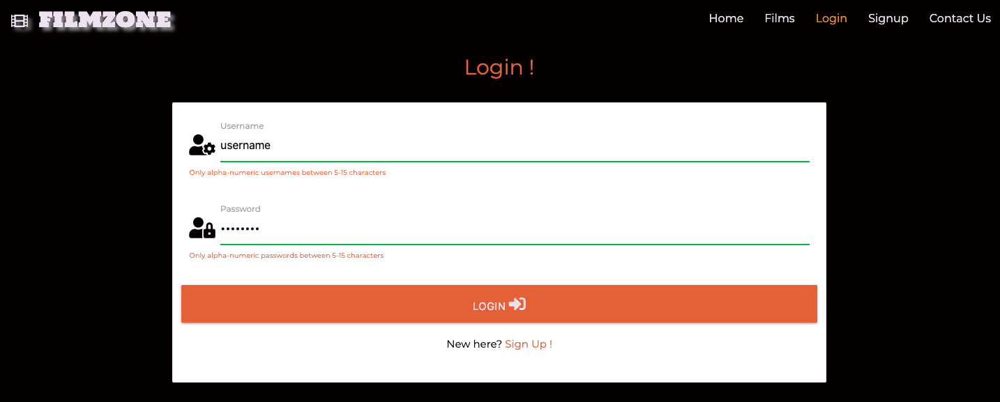

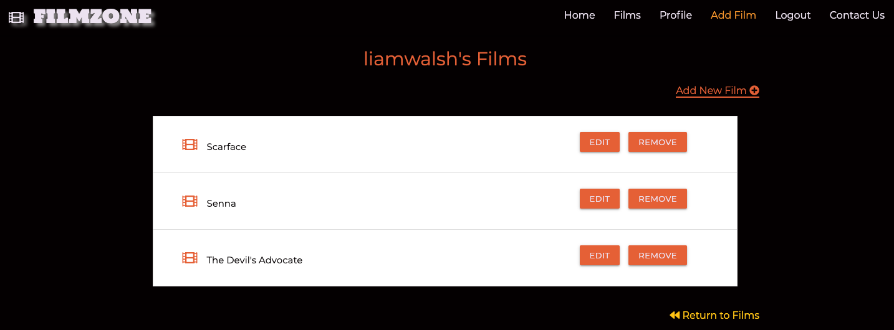

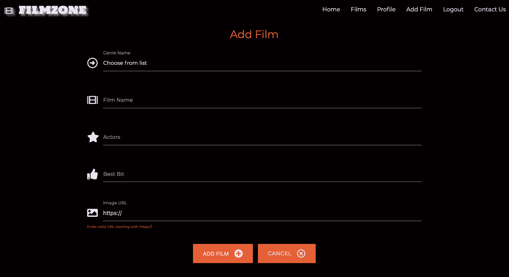

#### **Story 3**  
A registered user that just finished watching their favourite Film. After which they want to update the Film record on FilmZone to show all site visitors more information i.e. More actors, a different image, a favourite scene change. 
- FilmZone: This user can login to their account/profile and then within the profile page locate the film in question from the accordion and click the 'Edit' button to open up the Film details already added. The user can then make the changes they want and click 'Edit Film' to update the record.

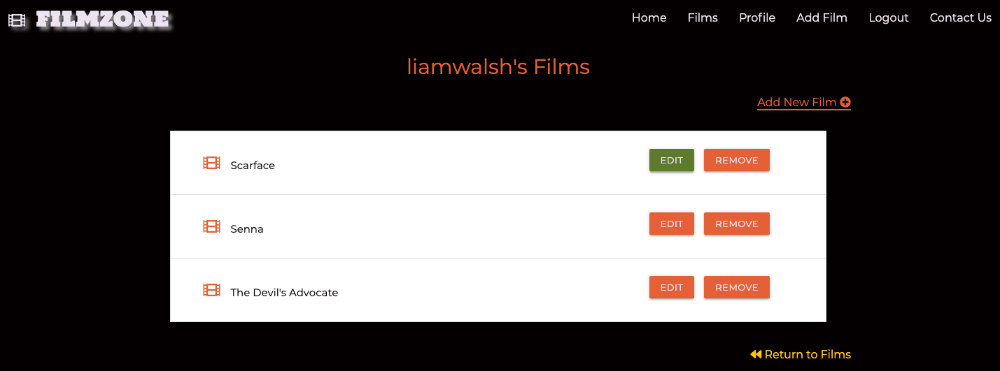

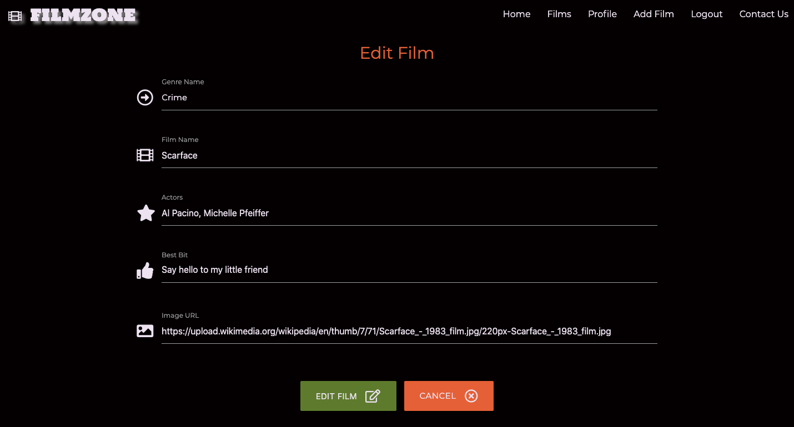

#### **Story 4**
I’m a regular visitor to FilmZone and would be keen to gain access to my own profile to add my own favourite Films.  
- FilmZone: This user can register an account and obtain a profile at anytime free of charge. To do this click the 'signup' link on the navbar. Once signed up and logged in this user can then start adding films to their profile

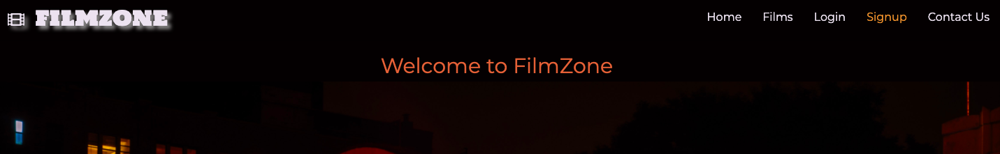

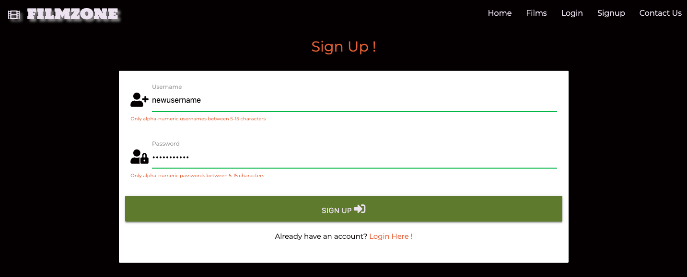

#### **Story 5**
I've noticed that theres a particular Genre type not listed for me to add a film to. How can i arrange for a new Genre type to be added?
- FilmZone: All users can click the 'Contact Us' link found at the end of the navbar. On this page users can communicate with FilmZone by completed the form and adding a relevant message in reference to the Genre type request. 

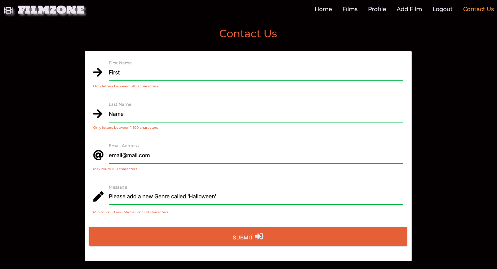

#### **Story 6**
I've just come out of the cinema after watching a great film. I'm keen to add this to my FilmZone profile but I'm not going to be at my computer until tomorrow morning now. 
- FilmZone can be accessed on any device. Therefore, this user can login to their FilmZone account profile and add a film on their smartphone just as easily as on desktop or laptop. They can then check the films page and profile page to see their new film thats just been added. 

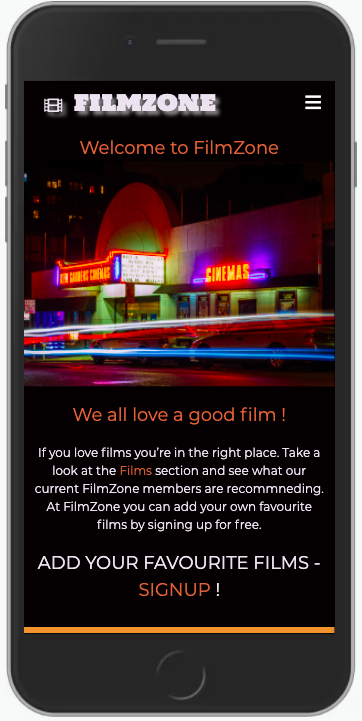

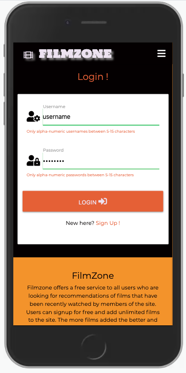

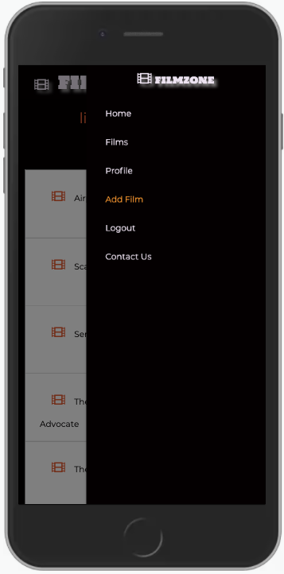

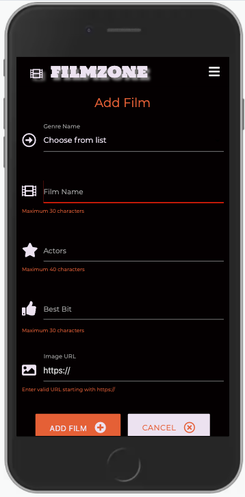

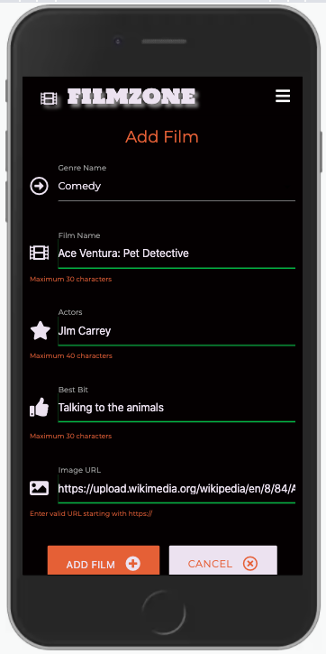

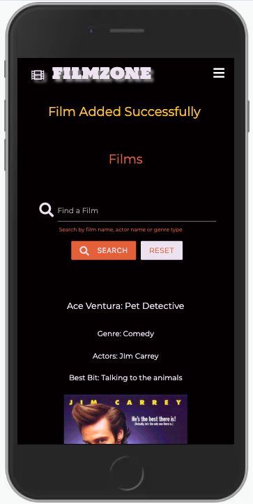

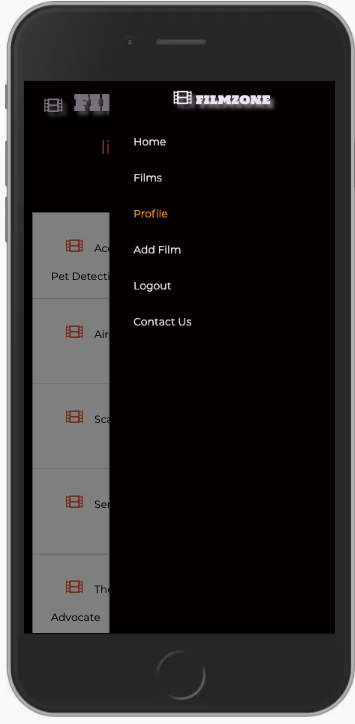

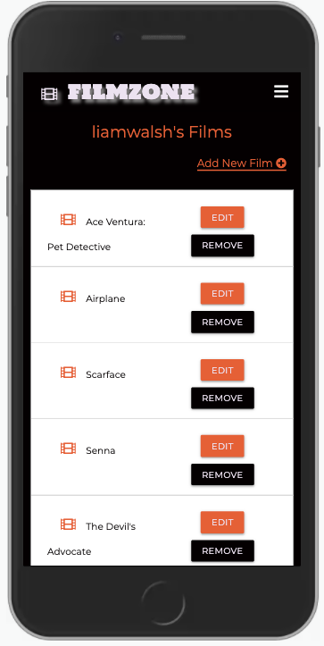

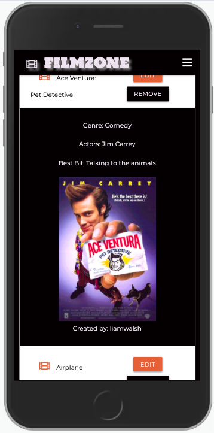

### W3C Markup Validation Service

#### Base template tested
#### Homepage tested
#### Films page tested
#### Signup page tested
#### Login page tested
#### Profile page tested
#### Add Film page tested
#### Edit Film page tested
#### Genres page tested
#### Add genre page tested
#### Edit genre page tested
#### Contact Us page tested

### W3C CSS Validation Service

#### CSS coding tested