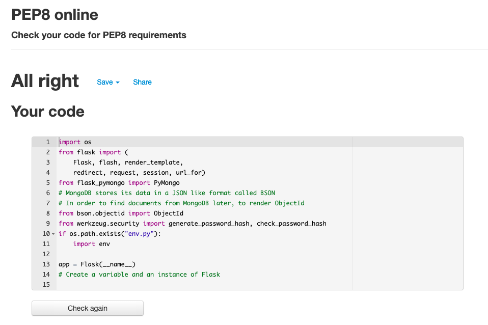
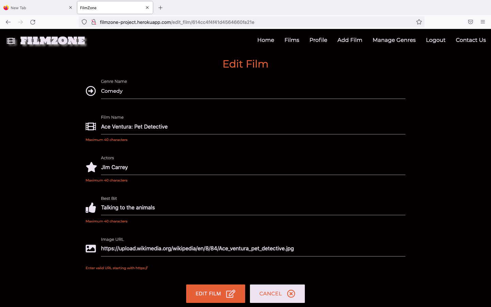
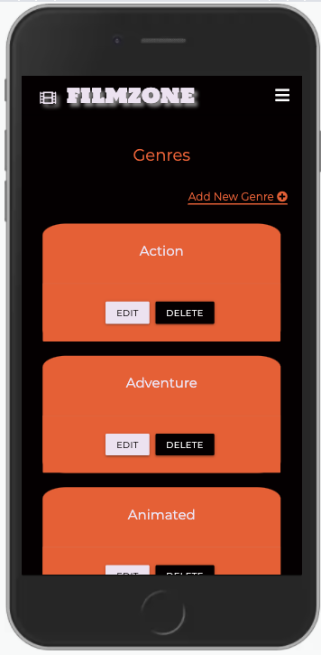
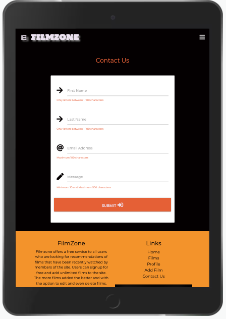
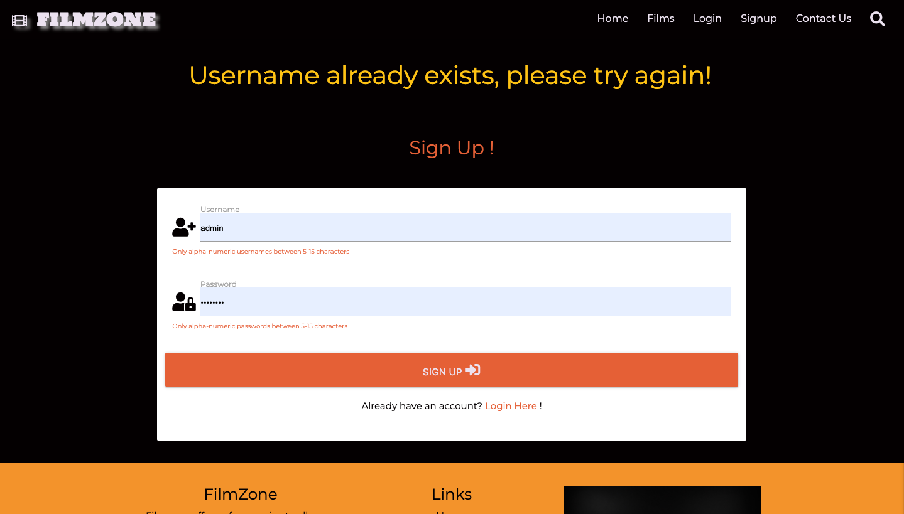
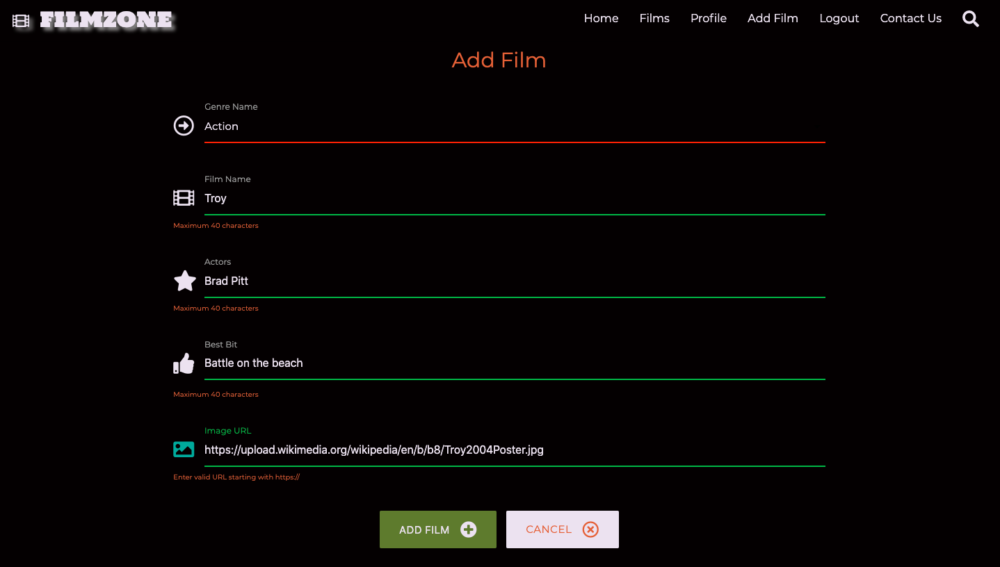
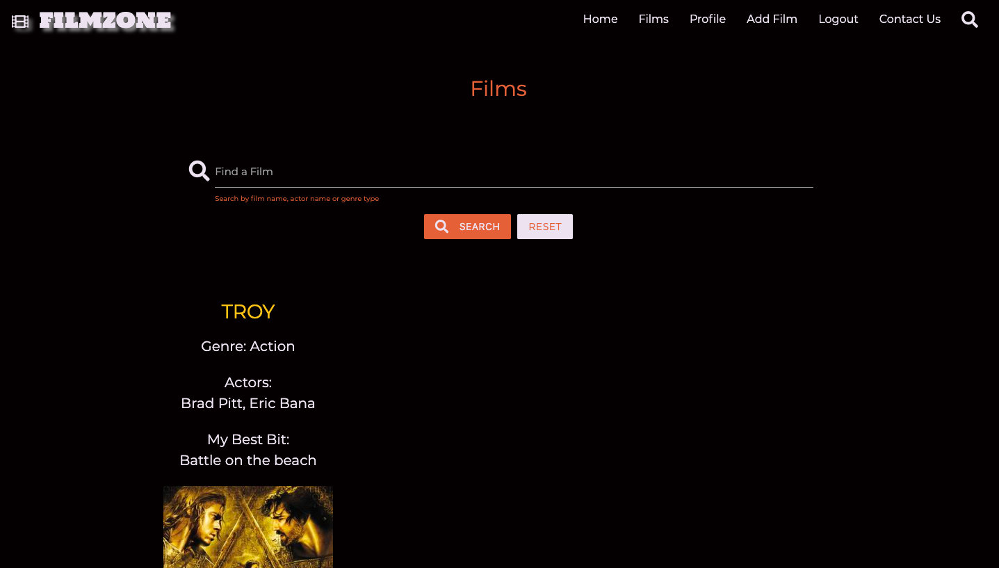

# FilmZone

## Code Institute - Milestone Project 3 (Testing)

<a href="https://filmzone-project.herokuapp.com/" target="_blank">Click here to view FilmZone live</a>

## Table of contents

1. [Testing](#testing)
    * [Screen sizes](#screen-sizes)
        * [Large screens](#large-screens)
        * [Small screens](#small-screens)
    * [Navigation bar menu](#navigation-bar-menu)
        * [Full screen navigation bar](#full-screen-navigation-bar)
        * [Hamburger navigation bar](#hamburger-navigation-bar)
    * [User stories tested ](#user-stories-tested)
        * [Story 1](#story-1)
        * [Story 2](#story-2)
        * [Story 3](#story-3)
        * [Story 4](#story-4)
        * [Story 5](#story-5)
        * [Story 6](#story-6)
    * [W3C Markup Validation Service](#w3c-markup-validation-service)
    * [W3C CSS Validation Service](#w3c-css-validation-service)
        * [CSS coding tested](#css-coding-tested)
    * [JS Hint Javascript code validator](#js-hint-javascript-code-validator)
        * [ScriptJS](#scriptjs)
        * [sendEmailJS](#sendemailjs)
    * [PEP8 online validator](#pep8-online-validator)
        * [App file](#app-file)
        * [Env file](#env-file)
    * [Web Browsers](#web-browsers)
        * [Google Chrome](#google-chrome)
        * [Apple Safari](#apple-safari)
        * [Microsoft Edge](#microsoft-edge)
        * [Mozilla Firefox](#mozilla-firefox)
    * [Testing responsiveness](#testing-responsiveness)
        * [Mobile screenshots](#mobile-screenshots)
        * [Tablet screenshots](#tablet-screenshots)
        * [Desktop screenshots](#desktop-screenshots)
    * [Lighthouse testing](#lighthouse-testing)
        * [Desktop results](#desktop-results)
        * [Mobile results](#mobile-results)
    * [Issues fixed](#issues-fixed)
        * [Films page layout](#films-page-layout)
        * [Modal issues](#modal-issues)
    * [Further testing](#further-testing)
        * [Internal links](#internal-links)
        * [External links](#external-links)
        * [Search facility](#search-facility)
        * [Testing functions](#testing-functions)
        * [EmailJS](#emailjs)
        * [Mobile first](#mobile-first)
    * [Bugs outstanding](#bugs-outstanding)

Return to my [README Doc](README.md) 

____
[Back to top ⇧](#filmzone)

## Testing

### Screen sizes
I decided to use the Materialize CSS grid (rows and columns) to structure the website offering good UX on all screen sizes. With this in mind the Laptop and Desktop screens (large) layout is different to tablet and mobile screens (small) on many pages. For example, on the Films page users can see 2 films side by side on bigger screens and 1 on smaller screen sizes.  

#### Large screens

#### Small screens

### Navigation bar menu
#### Full screen navigation bar
On big screens the navigation bar has page titles. Any page title that's hovered over changes color to indicate its a clickable link. I testing different styles for the Navbar however, i wanted to keep it clean and tidy. At one stage the 'Films' link was a dropdown menu giving users the option to click a film based on Genre. I decided to remove this feature for now to keep the navbar simple and easy to use. I added a search facility on the 'Films' page instead to make it easy for users to find a specific film based on Genre type. 

##### Logged out users

##### Logged in users

##### Logged in Admin user

____
[Back to top ⇧](#filmzone)

#### Hamburger navigation bar
When testing the navigation bar I wanted to make sure that it collapses into a hamburger menu (3 horizontal bars) on smaller screens. This is common practice to have and offers the user the option to look and click onto another page within the website. I made sure that the FilmZone logo and icon was shown at the top of the hamburder menu when a user opens the navnar on a smaller screen like a mobile or tablet. 

##### Logged out users

##### Logged in Admin user

##### Logged in Admin user

____
[Back to top ⇧](#filmzone)

### User Stories tested
#### **Story 1**
A user that doesn’t have an account visits FilmZone and wants ideas on what film to watch for the evening. This user enjoys all types of Films and likes the Actor Al Pacino. 
- FilmZone: If the user navigates to the 'Films' page and use the Search Facility to look up films with Al Pacino staring by typing in the search facility 'Al Pacino'. 

#### **Story 2**
I'm a registered user to FilmZone and I've just watched a new Film and want to offer a review for others to consider watching it.
- FilmZone: This user can login to their account/profile and then click the 'Add Film' from the Navbar or 'Add New Film' link from the profile page to then enable the option to add the new Film they have just watched. 

[Back to top ⇧](#filmzone)

#### **Story 3**  
A registered user that just finished watching their favourite Film. After which they want to update the Film record on FilmZone to show all site visitors more information i.e. More actors, a different image, a favourite scene change. 
- FilmZone: This user can login to their account/profile and then within the profile page locate the film in question from the accordion and click the 'Edit' button to open up the Film details already added. The user can then make the changes they want and click 'Edit Film' to update the record.

#### **Story 4**
I’m a regular visitor to FilmZone and would be keen to gain access to my own profile to add my own favourite Films.  
- FilmZone: This user can register an account and obtain a profile at anytime free of charge. To do this click the 'signup' link on the navbar. Once signed up and logged in this user can then start adding films to their profile

#### **Story 5**
I've noticed that theres a particular Genre type not listed for me to add a film to. How can i arrange for a new Genre type to be added?
- FilmZone: All users can click the 'Contact Us' link found at the end of the navbar. On this page users can communicate with FilmZone by completed the form and adding a relevant message in reference to the Genre type request. 

____
[Back to top ⇧](#filmzone)

#### **Story 6**
I've just come out of the cinema after watching a great film. I'm keen to add this to my FilmZone profile but I'm not going to be at my computer until tomorrow morning now. 
- FilmZone can be accessed on any device. Therefore, this user can login to their FilmZone account profile and add a film on their smartphone just as easily as on desktop or laptop. They can then check the films page and profile page to see their new film thats just been added. 

____
[Back to top ⇧](#filmzone)

### W3C Markup Validation Service

#### Most HTML templates had the following errors and warnings. 

- Warning:  Consider adding a lang attribute to the html start tag to declare the language of this document. 
**Lang attribute is already in place on the base template which is extended to this HTML template.**

- Error: Non-space characters found without seeing a doctype first. Expected DOCTYPE html 
**This is already in place on the base template which is extended to this HTML template.**

- Error: Element head is missing a required instance of child element title. 
**This is already in place on the base template which is extended to this HTML template.**

- Error: Bad value {{ url_for..... }} for attribute href/src/action on element a: Illegal character in path segment: { is not allowed. 
**Bad value: 'url for' is common across all HTML template files. It was also to be expected, as the validator was not anticipating to find href="...url_for..."**

- Warning: Section lacks heading. Consider using h2-h6 elements to add identifying headings to all sections. 
**By adjusting the code and using an h1 element for example, this then causes an error - Element div not allowed as child of element h1 in this context. (Suppressing further errors from this subtree.).**

- Error: Text not allowed in element ul in this context -  and  
**Jinja for loop used inside an unordered list which cannot be changed for anything else in order for it to work**

- Error: Text not allowed in element select in this context -  and  
**Jinja for loop used inside a select element which cannot be changed for anything else in order for it to work**

- Error: Text not allowed in element select in this context -  and  
**Jinja if statement used inside a select element which cannot be changed for anything else in order for it to work**

____
[Back to top ⇧](#filmzone)

### W3C CSS Validation Service

#### CSS coding tested
* 0 errors returned
* 1 warning returned
    - Imported style sheets are not checked in direct input and file upload modes (line 2)

#### JS Hint JavaScript code validator

#### ScriptJS
* (0 errors found)
* (2 warnings found)
    - Line 12: let' is available in ES6 (use 'esversion: 6') or Mozilla JS extensions (use moz)
    - Line 13: let' is available in ES6 (use 'esversion: 6') or Mozilla JS extensions (use moz)

#### sendEmailJS
* (0 errors found)
* (0 warnings found)

#### PEP8 online validator

#### App file
* No errors

#### Env file
* 1 Error (line 12: line too long (126 > 79 characters))

**Fixed by moving half the code onto another line below, however doing this causes more serious errors.**

Note: No image applied for security of password

____
[Back to top ⇧](#filmzone)

### Web Browsers

I tested the website across four different web browsers making sure that links worked and pages loaded properly. 

#### Google Chrome
The site was developed using Chrome and therefore testing was being done daily on this browser.

**Homepage**

**Films page**

**Signup page**

**Login page**

**Profile page**

**Add film page**

**Edit film page**

**Genres page**

**Add genre page** 
Note: Adjustment made to the color of the 'Cancel' button to keep the theme of the site consistant

**Edit genre page**

**Contact us page**

____
[Back to top ⇧](#filmzone)

#### Apple Safari

**Homepage**

**Films page**

**Signup page**

**Login page**

**Profile page**

**Edit film page**

**Genres page**

**Add genre page** 
Note: Adjustment made to the color of the 'Cancel' button to keep the theme of the site consistant

**Edit genre page**

**Contact us page**

____
[Back to top ⇧](#filmzone)

#### Microsoft Edge

**Homepage**

**Films page**

**Signup page**

**Login page**

**Profile page**

**Add film page**

**Edit film page**

**Genres page**

**Add genre page**
Note: Adjustment made to the color of the 'Cancel' button to keep the theme of the site consistant - **Adjustment made**

**Edit genre page**

**Contact us page**

____
[Back to top ⇧](#filmzone)

#### Mozilla Firefox

**Homepage**

**Films page**

**Signup page**

**Login page**

**Profile page**

**Add film page**

**Edit film page**

**Genres page**

**Add genre page** 
Note: Adjustment made to the color of the 'Cancel' button to keep the theme of the site consistant - **Adjustment made**

**Edit genre page**

**Contact us page**

### Testing responsiveness

I tested the site using Chrome development tools on three different screen sizes to make sure that all features, content, images, links, search facility, card panels, accordion and buttons worked across all screen sizes.

#### Mobile screenshots

**Homepage**

**Films page**

**Signup page**

**Login page**

**Profile page**

**Add film page**

**Edit film page**

**Genres page**

**Add genre page**

**Edit genre page**

**Contact us page**

____
[Back to top ⇧](#filmzone)

#### Tablet screenshots

**Homepage**

**Films page**

**Signup page**

**Login page**

**Profile page**

**Add film page**

**Edit film page**

**Genres page**

**Add genre page**

**Edit genre page**

**Contact us page**

____
[Back to top ⇧](#filmzone)

#### Desktop screenshots

**Homepage**

**Films page**

**Signup page**

**Login page**

**Profile page**

**Add film page**

**Edit film page**

**Genres page**

**Add genre page**

**Edit genre page**

**Contact us page**

____
[Back to top ⇧](#filmzone)

### Lighthouse testing

#### Desktop results

* Performance 85% (Issue: Largest Contentful Paint)
* Accessibility 90% 
* Best Practices 93%
* SEO 100%

#### Mobile results

* Performance 64% (Issues: Largest Contentful Paint and Time to Interactive)
* Accessibility 90%
* Best Practices 93%
* SEO 91%

Note: Unfortunately, I didn't have any time left on this project to look into the issues properly. With more time i would investigate why the Performance scores are lower than i would like and also why the Accessibility score is low compared to previous projects. 
____
[Back to top ⇧](#filmzone)

### Issues fixed

#### Films page layout

On the Films page. I had an issue with the layout as films were being added. Big gaps appeared making the page look untidy. I spoke with a couple of other students on slack and with the help of my Mentor i fixed the issue using media queries in my custom styling file. I also applied some maxlenth attributes to the fields within the HTML file to restrict content. Before and after images below.

**Before**

**After**

____
[Back to top ⇧](#filmzone)

#### Modal issues

On the profile page and genres page theres a remove/delete button to remove a film or delete a genre type. I added defensive code using a modal from Materialize. It didn't work at first because there was no index.loop supporting the href and the id in the modal structure was connected to the modal-trigger properly. After some research using the Materialize website i was able to successfully use a Modal. This now allows users to confirm whether they want to remove/delete a film or genre type or cancel the request to remove/delete. 

____
[Back to top ⇧](#filmzone)

### Further testing

#### Internal links

All internal links tested: -
- Text logo on desktop 
- Navbar links
- Mobile Nav links
- Footer links
- Homepage links
- Films page search button links
- Signup page links
- Login page links
- Profile links and buttons links
- Add page button links
- Edit page button links
- Genres page links and button links
- Add page button links
- Edit page button links
- Contact us page links 

#### External links

All social media links tested within the footer: -
- YouTube
- Spotify
- Twitter
- Instagram
- Facebook

#### Search facility

Testing completed on the search bar found in the films page.

Testing based on name (Robert)

Testing based on genre type (Comedy)

Testing based on film name (airplane)

### Testing functions

#### Signup page

#### Login page

#### Logout function 

#### Add film page

#### Edit film page 

#### Delete/Remove film function

#### Add genre page

#### Edit genre page

#### Delete genre page

#### EmailJS

Screenshots below showing that the Contact Us page is fully working

**Contact us page completed**

**Contact us page submitted/Modal message**

**Auto message sent to user**

**Message from user to FilmZone**

#### Mobile first
* I know it's important to build a new site as a mobile first application, therefore, during the design process and building the site I made sure that extensive testing was done on all mobile screen sizes using <a href="https://developer.chrome.com/docs/devtools/" target="_blank">Chrome development tools</a>. I worked with the following screen sizes making sure that all users can enjoy the site using any type of smartphone device: - 

    - 320px (iPhone 5 size)
    - 360px (Moto G4 and Galaxy S5) 
    - 375px (iPhone 6/7/8/X size)
    - 411px (Pixel 2/XL and iPhone 6/7/8 plus) 
____        
[Back to top ⇧](#filmzone)

Return to my [README.md](README.md) to continue reading

### End of TESTING Documentation
